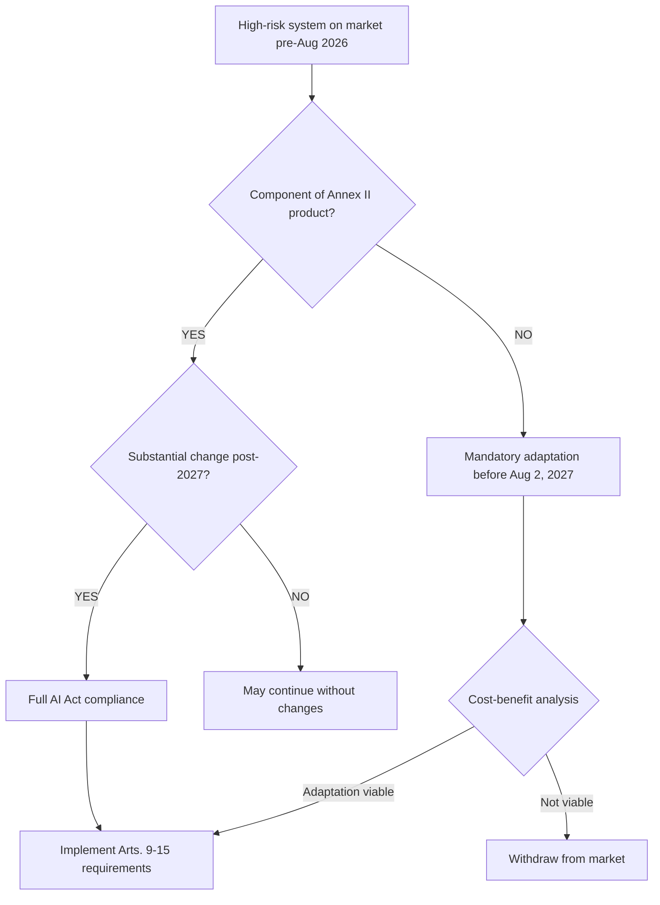

# AI Act: Complete Legal Guide to the European Artificial Intelligence Regulation

*By Ricardo Scarpa | Updated: February 8, 2026 | Reading time: 50 minutes*

---

## Executive Summary

The **AI Act** (EU Regulation 2024/1689) represents the world's first comprehensive legal framework for regulating artificial intelligence, establishing the global governance standard for AI systems with extraterritorial effect. Published on July 12, 2024, and in force since August 1, 2024, its application is **phased until 2027** through a risk-based approach that differentiates four levels of systems: prohibited, high-risk, transparency, and minimal risk.

**Critical mandatory compliance dates:**
- **February 2, 2025:** Effective prohibition of unacceptable risk practices (Art. 5) – No extension possible
- **August 2, 2025:** Obligations for general-purpose AI (GPAI) models and supervisory authorities
- **August 2, 2026:** Full compliance for new high-risk AI systems marketed after this date
- **August 2, 2027:** Mandatory adaptation of existing high-risk AI systems already on the market

**System classification by risk level:**

| Level | Criterion | Examples | Regime |
|-------|-----------|----------|--------|
| **Prohibited** | Unacceptable risk to EU values | Government social scoring, subliminal manipulation, criminal prediction by profiling | Absolute prohibition, immediate cessation |
| **High Risk** | Significant impact on fundamental rights (Annex III) | HR, education, credit scoring, justice, biometric identification | Obligations Arts. 9-15, conformity assessment, CE marking |
| **Transparency** | Human-machine interaction | Chatbots, deepfakes, emotion recognition systems | Duty to inform user |
| **Minimal** | No significant impact | Spam filters, video games, simple industrial AI | Voluntary codes of conduct |

**Obligations for providers of high-risk systems:** Continuous risk management system (Art. 9), data governance and bias-free training data quality (Art. 10), exhaustive technical documentation with 10-year retention (Art. 11), automatic logging capabilities for traceability (Art. 12), transparency and clear user instructions (Art. 13), design enabling effective human oversight with intervention capability (Art. 14), appropriate accuracy, robustness, and cybersecurity (Art. 15), internal conformity assessment (Annex VI) or external assessment by notified body (Annex VII), CE marking, and EU database registration before market placement.

**Proportionate sanctions regime:** Administrative fines up to **35 million EUR or 7% of annual global turnover** (whichever is higher) for prohibited practices under Art. 5; **15 million EUR or 3%** for non-compliance with high-risk system obligations; **7.5 million EUR or 1.5%** for incorrect information to authorities. Sanctions are proportionate for SMEs (3% turnover limit) but there is no de minimis.

**Interaction with GDPR:** Both regulations are **complementary and cumulative**, not substitutive. The AI Act does NOT constitute a legal basis for personal data processing, which must be independently found in Art. 6 GDPR. For AI systems processing personal data, **two impact assessments are required**: FRIAS from Art. 27 AI Act (fundamental rights) + DPIA from Art. 35 GDPR (data protection).

**Systemic risk GPAI models:** Critical threshold of computational capability **>10²⁵ FLOPs** in training. Enhanced obligations: adversarial evaluations (red teaming), monitoring and reporting of serious incidents to AI Office, state-of-the-art cybersecurity, copyright respect policy with technical opt-out for text and data mining.

This guide exhaustively analyzes all regulatory, technical, and operational aspects of the AI Act, providing IRAC methodology in practical cases, comparative tables, case law analysis, implementation checklist by actor type, and resources for effective compliance in Spanish and European organizations.

---

## Table of Contents

**PART I: FUNDAMENTALS AND CONTEXT**
1. [What is the AI Act? Introduction to the European AI Regulation](#que-es-ai-act)
2. [Application Timeline 2024-2027: Critical Dates](#calendario-aplicacion)
3. [Scope of Application: Definition of AI System](#ambito-aplicacion)

**PART II: SYSTEM CLASSIFICATION**
4. [Prohibited Practices: Unacceptable Risk (Art. 5)](#practicas-prohibidas)
5. [High-Risk Systems: Detailed Annex III](#sistemas-alto-riesgo)
6. [Biometric Identification: Exception Regime](#identificacion-biometrica)
7. [GPAI Models and Systemic Risk](#modelos-gpai)

**PART III: OPERATIONAL OBLIGATIONS**
8. [Provider Obligations (Arts. 9-15)](#obligaciones-proveedores)
9. [User and Deployer Obligations (Art. 26)](#obligaciones-usuarios)
10. [Conformity Assessment and CE Marking](#evaluacion-conformidad)

**PART IV: SUPERVISION AND SANCTIONS**
11. [Sanctions Regime of the AI Act](#regimen-sancionador)
12. [Competent Authorities in Spain](#autoridades-espana)
13. [Fundamental Rights Impact Assessment (FRIAS)](#frias)

**PART V: REGULATORY INTERACTION**
14. [AI Act and GDPR: Joint Application](#ai-act-rgpd)
15. [Specific Sectoral Regulations](#normativa-sectorial)
16. [AI Act and Intellectual Property](#ai-act-propiedad-intelectual)

**PART VI: PRACTICAL CASES**
17. [Case 1: AI Personnel Selection System (HR)](#caso-rrhh)
18. [Case 2: Customer Service Chatbot](#caso-chatbot)
19. [Case 3: Facial Recognition Access](#caso-reconocimiento-facial)
20. [Case 4: General Purpose Language Model](#caso-llm)
21. [Case 5: Credit Scoring](#caso-scoring)
22. [Case 6: Medical Diagnostic System](#caso-medicina)

**PART VII: PRACTICAL IMPLEMENTATION**
23. [Relevant Case Law: SCHUFA Case](#jurisprudencia)
24. [Compliance Resources and Tools](#recursos)
25. [Implementation Checklist by Actor](#checklist)
26. [Technical-Legal Glossary](#glosario)
27. [FAQ: 15 Frequently Asked Questions](#faq)
28. [Conclusions and Next Steps](#conclusiones)

**Reading time:** 50 minutes | **Words:** 12,500+ | **Last updated:** February 2026

---

<a name="que-es-ai-act"></a>
## 1. What is the AI Act? Introduction to the European Artificial Intelligence Regulation

The **AI Act** —officially designated as **Regulation (EU) 2024/1689 of the European Parliament and of the Council of June 13, 2024, laying down harmonised rules on artificial intelligence**— constitutes the world's first comprehensive regulation of artificial intelligence systems. Its publication in the Official Journal of the European Union on July 12, 2024 (OJ L, 12.7.2024) and entry into force on August 1, 2024 mark a historic milestone in global technology governance.

### The Regulatory Paradigm Shift: From Directives to Regulation

Historically, the European Union addressed digitization through **Directives** that allowed differentiated national transposition. Paradigmatic examples include:
- Directive 2000/31/EC (Electronic Commerce)
- Directive 2001/29/EC (Infosoc - Copyright in the Information Society)
- Directive 2002/58/EC (ePrivacy)

The result was **fragmentation of the digital internal market**: the same technological service faced 27 different legal regimes, generating legal uncertainty, multiplied compliance costs, and obstacles to the free circulation of digital services.

The **AI Act radically breaks** with this past by adopting the form of **Regulation**, which pursuant to Art. 288 of the Treaty on the Functioning of the European Union (TFEU) is "binding in its entirety and directly applicable in each Member State." This strategic decision materializes the axiom **"one continent, one rule, one market."**

**Implications of the Regulation character:**

1. **Absolute regulatory uniformity:** No national transposition margin exists. All 27 Member States apply exactly the same legal text.

2. **Direct effect:** The AI Act is directly invocable by citizens and companies before national courts without need for internal legislative development.

3. **European passport:** An AI system certified under the AI Act in any Member State is automatically marketable throughout the EU without additional assessments.

4. **Cost reduction:** Companies avoid the multiplication of conformity procedures for each national market, generating significant scale economies.

### Historical Context and Legislative Process

**Complete chronology of the legislative process:**

| Date | Milestone | Description |
|-------|-----------|-------------|
| February 2020 | AI White Paper | European Commission presents regulatory options in strategic document |
| April 21, 2021 | Commission Proposal | Formal presentation of the initial draft Regulation |
| 2021-2023 | Negotiations (trilogue) | Parliament and Council propose 1,200+ substantial amendments |
| December 9, 2023 | Political Agreement | Trilogue reaches final consensus after 37 hours of continuous negotiation |
| March 13, 2024 | Parliament Approval | Plenary vote: 523 votes in favor, 46 against, 49 abstentions |
| May 21, 2024 | Council Approval | Formal adoption by qualified unanimity of Member States |
| July 12, 2024 | OJ Publication | Appearance in EU Official Journal (series L) |
| August 1, 2024 | Entry into Force | Pursuant to Art. 297.1 TFEU (20 days after publication) |

**Inflection point:** The process was characterized by tensions between:
- **European Parliament:** Prioritized fundamental rights protection, pushed for strict prohibitions
- **Council (Member States):** Defended industrial competitiveness, especially France and Germany concerned about their technological champions
- **Commission:** Acted as mediator seeking innovation-protection balance

The final text is a **compromise** that maintains the risk-based approach but introduces flexibilities through regulatory sandboxes (Arts. 57-60) and preferential treatment for startups and SMEs (Art. 99.8).

### Strategic Objectives of the AI Act

The Regulation pursues four interrelated objectives (Recital 1):

#### 1. **Ensuring AI System Safety**

The AI Act requires that AI systems placed on the market or put into service in the EU be **safe throughout their entire lifecycle**. This transcends mere absence of technical failures:

**Safety implies protection against:**
- Physical harm to persons (e.g., autonomous vehicle with defective AI system)
- Property damage
- Violation of fundamental rights
- **Discriminatory impacts** on vulnerable groups (women, ethnic minorities, persons with disabilities)

**Provider obligation:** Identify and mitigate not only risks from **intended use** but also from **reasonably foreseeable misuse** (Art. 9.2.b). This extends responsibility beyond original design.

**Example:** AI system for medical diagnosis must anticipate that physicians might over-rely on recommendations, reducing their own clinical analysis (automation bias).

#### 2. **Protecting Citizens' Fundamental Rights**

The AI Act proceeds from the premise that certain AI uses may threaten rights enshrined in the **EU Charter of Fundamental Rights**:

| Right (EU Charter) | Potential AI Threat | AI Act Protection Mechanism |
|---------------------|---------------------|----------------------------|
| Human dignity (Art. 1) | Cognitive manipulation | Absolute prohibition (Art. 5.1.a) |
| Equality and non-discrimination (Arts. 20-21) | Algorithmic biases | Data governance (Art. 10) + FRIAS (Art. 27) |
| Data protection (Art. 8) | Mass surveillance | Real-time biometrics prohibition (Art. 5.1.h) |
| Effective remedy (Art. 47) | Opaque decisions | Transparency (Art. 13) + human oversight (Art. 14) |
| Freedom of expression (Art. 11) | Automated censorship | Specific safeguards (Recital 28) |

**Practical materialization:**
- **Absolute prohibitions:** 8 categories of unacceptable risk practices (Art. 5)
- **Enhanced obligations:** For high-risk systems in sensitive areas (Art. 6 + Annex III)
- **FRIAS:** Preventive impact assessment on fundamental rights (Art. 27)

#### 3. **Facilitating Responsible Innovation**

Contrary to perceptions of certain technology actors, the AI Act **does not aim to stifle innovation** but to channel it toward the "Trustworthy AI" model defined by the Commission's High-Level Expert Group.

**Pro-innovation mechanisms:**

**a) Regulatory Sandboxes (Arts. 57-60):**
- Controlled testing environments under authority supervision
- Temporary flexibilization of requirements for innovative systems
- Priority for startups and SMEs
- **Maximum duration:** Determined by national authority (typically 6-24 months)
- **Limitation:** Does NOT exempt from fundamental rights protection obligations

**b) SME Support (Art. 99.8):**
- Proportionate sanctions with **3% global turnover maximum limit**
- Preferential treatment in conformity procedures
- Priority access to sandbox

**c) Harmonized Standards (Art. 40):**
- European technical standards developed by CEN/CENELEC/ETSI
- **Conformity presumption:** System complying with harmonized standard is presumed to comply with AI Act
- Reduces evidentiary burden in assessment
- **Current status (Feb 2026):** First standards expected Q3-Q4 2026

**d) Voluntary Codes of Conduct (Art. 95):**
- For minimal risk systems
- Demonstrate excellence beyond legal obligations
- Potential reputational competitive advantage

#### 4. **Creating a Single Digital Market for AI**

Prior regulatory fragmentation generated:
- **Cost multiplication:** A company had to certify its product 27 times
- **Legal uncertainty:** Divergent interpretations among Member States
- **Commercial barriers:** Hidden protectionism through regulation

**AI Act solution:**

```
┌──────────────────────────────────────────────────────┐
│  BEFORE: Directives → 27 different regimes          │
│  ────────────────────────────────────────────        │
│  Company X develops AI system                        │
│    ├─ Spain: AEPD certification                      │
│    ├─ France: CNIL certification                     │
│    ├─ Germany: BfDI certification                   │
│    └─ [... x24 more Member States]                   │
│  Total cost: N x (assessment + legal + time)        │
└──────────────────────────────────────────────────────┘

┌──────────────────────────────────────────────────────┐
│  NOW: Regulation → 1 single regime                   │
│  ────────────────────────────────────────────        │
│  Company X develops AI system                        │
│    └─ Conformity assessment ONCE                     │
│        ├─ CE marking                                  │
│        ├─ EU database registration                    │
│        └─ Automatic marketing in 27 States           │
│  Total cost: 1 x (assessment + legal + time)        │
└──────────────────────────────────────────────────────┘
```

**Quantifiable benefits:**
- Estimated 70% reduction in cross-border compliance costs
- Time-to-market reduced from 18-24 months to 6-9 months
- Elimination of regulatory arbitrage (regime shopping)

### Guiding Principles of the AI Act

The Regulation rests on **four philosophical pillars**:

#### 1. **Human-Centric Approach** 🧑

**Principle:** AI must serve humanity, not the other way around.

**Normative manifestations:**
- **Art. 14:** Mandatory human oversight for high-risk systems
- Design enabling natural persons to:
  - Understand system capabilities and limitations
  - Detect anomalies and deviations
  - Decide not to use or interrupt the system
  - **Intervene and override system decisions**

**Complete substitution prohibition:** No high-risk system can operate totally autonomously without possibility of effective human intervention.

**Connection with GDPR:** Right to explanation of automated decisions (Art. 22.3 GDPR) is reinforced with obligation for understandable technical documentation (Art. 11 AI Act).

#### 2. **Transparency** 🔍

**Principle:** Citizens have the right to know when they interact with AI.

**Manifestations:**

**a) Disclosure obligation (Art. 50):**
- **Chatbots:** User must be immediately informed they interact with AI system
- **Emotion recognition systems:** Clear notification
- **Exception:** When obvious from circumstances and context

**b) Synthetic content marking (Art. 50.4):**
- **Deepfakes:** Manipulated content must be clearly labeled
- **AI-generated content:** Watermarks or metadata
- **Images/audio/video:** Detection technologies implemented

**c) Documentation accessible to authorities:**
- Complete technical documentation (Art. 11)
- Instructions for deployers (Art. 13)
- Traceable automatic logs (Art. 12)

#### 3. **Accountability** ⚖️

**Principle:** Clear and differentiated responsibilities throughout the value chain.

**Actors and obligations:**

| Actor | Definition (Art. 3) | Main Obligations |
|-------|--------------------|--------------------|
| **Provider** | Develops or has AI developed for marketing | Arts. 16-23: Conformity, CE marking, post-market surveillance |
| **Importer** | Places on EU market AI system from third-country provider | Art. 25: Verify compliance before placing on market |
| **Distributor** | Makes AI system available on market | Art. 24: Due diligence on CE marking and documentation |
| **Deployer** | Uses system under their authority (except personal use) | Art. 26: Use per instructions, oversight, incident reporting |
| **Authorized representative** | EU contact point for third-country provider | Art. 22: Ensure compliance, cooperate with authorities |

**Traceability of responsibility:** If system causes harm, the chain of responsibilities allows identifying the actor who breached their specific obligation.

#### 4. **Democratic Governance** 🏛️

**Principle:** AI control cannot remain exclusively in private hands.

**Multi-level governance architecture:**

**EU Level:**
- **European AI Office** (Art. 64): European Commission body
  - Supervision of GPAI models with systemic risk
  - Coordination of national authorities
  - Secretariat of European AI Board
- **European AI Board** (Art. 65): 
  - Composition: National authority representatives
  - Function: Application consistency, dispute resolution
- **Scientific Panel** (Art. 68):
  - Independent experts
  - Technical advice on state of the art

**National Level:**
- **Competent authorities** (Art. 70):
  - Market surveillance
  - Sanctioning power
  - In Spain: AEPD (personal data systems) + pending authority designation (systems without data)

**Multi-stakeholder Level:**
- **Expert groups** multidisciplinary
- **Periodic public consultations**
- **Civil society participation**

### Legal Definition of AI System (Art. 3.1)

The Regulation's legal certainty rests on a **technologically neutral but legally precise** definition of "AI system":

> **Article 3.1 AI Act:**  
> "Artificial intelligence system" (AI system): a machine-based system designed to operate with varying levels of **autonomy** and that may exhibit **adaptability** after deployment, and that, for explicit or implicit objectives, **infers** how to generate outputs such as predictions, content, recommendations, or decisions that may influence physical or virtual environments.

**Three cumulative constituent elements:**

#### a) **Inference Capability**

**Technical definition:** Process by which the system deduces models, algorithms, or patterns from input data to generate outputs.

**Key distinction vs. traditional software:**

| Traditional Software | AI System |
|---------------------|---------------|
| Explicit rules programmed by humans | Rules inferred from data by algorithm |
| `if age < 18 then deny` | System analyzes 100,000 cases and deduces which variable combination predicts approval |
| Deterministic | Probabilistic |
| Programmer logic visible | Partial "black box" |

**Legal implication:** Inference introduces **opacity** that justifies enhanced documentation and explainability obligations.

#### b) **Autonomy**

**Definition:** The system can operate with varying levels of independence, acting without continuous direct human intervention.

**Autonomy spectrum:**
- **Low:** System requires human validation for each decision
- **Medium:** System operates independently but under periodic human supervision
- **High:** System makes decisions and acts with minimal human intervention

**Note:** The AI Act does NOT require complete autonomy. "Varying levels" suffices (Recital 12).

#### c) **Adaptability**

**Definition:** System's capability to change its operation **after deployment** through:
- **Continuous learning:** System improves with new data (e.g., Netflix recommendations)
- **Self-optimization:** Adjusts internal parameters
- **Transfer learning:** Applies knowledge from one domain to another

**Important:** Adaptability is a **non-mandatory criterion** ("may exhibit"). AI systems without post-deployment adaptability are also covered.

### Systems Excluded from Scope

**Art. 2.2-2.7 establishes exclusions:**

#### 1. **Exclusively military or defense AI (Art. 2.3)**
- Systems developed or used solely for military purposes
- **Rationale:** Exclusive competence of Member States in national defense

#### 2. **Scientific R&D (Art. 2.6)**
- Systems used **exclusively** for scientific research and development
- **Before** their placement on market or putting into service
- **Exclusion ceases:** When system is marketed or operatively deployed

#### 3. **Free/open-source software - with nuances (Art. 2.7)**
- Software whose code is **open and freely available**
- **EXCEPTION:** If put into service as high-risk system or GPAI, the AI Act DOES apply
- **Important:** Mere open-source publication on GitHub does NOT exempt if then operatively deployed

#### 4. **AI components in products regulated by sectoral legislation (Art. 2.4)**
- AI integrated in already regulated products (e.g., Medical Devices Regulation, Machinery Regulation)
- **Condition:** Sectoral legislation already covers AI safety aspects
- **Regime:** Integrated conformity assessment (AI Act + sectoral legislation)

---

<a name="calendario-aplicacion"></a>
## 2. AI Act Application Timeline 2024-2027: Critical Compliance Dates

The European Commission has designed a **phased application regime** to allow orderly transition of the business ecosystem toward regulatory compliance. Non-compliance with these deadlines entails **systemic financial, reputational, and operational risks**.

### Complete Timeline

```
1 AUGUST 2024          2 FEBRUARY 2025         2 AUGUST 2025          2 AUGUST 2026          2 AUGUST 2027
      │                       │                      │                      │                      │
  ENTRY INTO            PROHIBITIONS            GPAI MODELS           HIGH-RISK              SYSTEMS
  FORCE                 (Art. 5 effective)     (Ch. V effective)    (New systems)          (Existing)
  (No obligations)      │                      │                      │                      │
      │                       │                      │                      │                      │
      │                       │                      │                      │                      │
  Authorities           Immediate cessation    Transparency         Conformity            Mandatory
  designated            of prohibited           training data        assessment            adaptation
  │                      practices               Copyright            + CE marking         or withdrawal
```

### Phase 0: Entry into Force (August 1, 2024)

**Legal basis:** Art. 113.1 - "This Regulation shall enter into force on the twentieth day following its publication in the Official Journal of the European Union"

**Publication date:** July 12, 2024  
**Entry into force:** August 1, 2024 (pursuant to Art. 297.1 TFEU)

**What does "entry into force" mean?**
- The Regulation is **law in force** from this date
- Does NOT generate immediate compliance obligations (deferred application)
- Transition period begins for business adaptation
- Member States must **designate competent authorities** (Art. 70.1)

**Recommended business actions (Aug-Dec 2024):**
- [ ] Conduct preliminary inventory of AI systems in the organization
- [ ] Identify external providers of AI solutions
- [ ] Train internal teams on basic AI Act concepts
- [ ] Initiate preliminary system classification assessment
- [ ] Budget necessary investment for 2025-2027 compliance

### Phase 1: Prohibited Practices (February 2, 2025) 🚨

**Legal basis:** Art. 113.2 - "Chapter II shall apply from February 2, 2025"

**Applicable articles:** Art. 5 complete (8 categories of prohibited practices)

**Obligation:** Immediate cessation of marketing, putting into service, or use of systems constituting prohibited practices of **unacceptable risk**.

**8 prohibited practices effective from Feb 2, 2025:**

| Category | Art. | Description | Example |
|----------|------|-------------|---------|
| 1. Subliminal manipulation | 5.1.a | Techniques beyond consciousness to alter behavior | Subliminal frequencies in advertising |
| 2. Exploitation of vulnerabilities | 5.1.b | Exploiting age, disability, socioeconomic situation | AI toys incite dangerous behavior in children |
| 3. Government social scoring | 5.1.c | Evaluation/classification by social behavior | Chinese "social credit" style system |
| 4. Individual crime prediction | 5.1.d | Assessing risk of committing crimes solely by profiling/traits | AI predicts criminality by postal code |
| 5. Mass facial scraping | 5.1.e-f | Non-selective extraction of images for facial recognition DB | Mass social media tracking |
| 6. Emotion inference in work/education | 5.1.g | Detecting emotional states (except medical/security) | AI detects student boredom |
| 7. Sensitive biometric categorization | 5.1.g | Classifying by race, religion, sexual orientation | AI categorizes ethnicity at border control |
| 8. Real-time biometrics in public spaces | 5.1.h | Remote biometric identification in real time (3 exceptions) | Street facial recognition cameras |

> ⚠️ **CRITICAL ATTENTION:**  
> This date admits NO extension. The prohibition is effective from the first second of February 2, 2025. Any subsequent use constitutes a **very serious violation** regardless of when the system was developed.

**Non-compliance consequences:**
- Sanctions up to **35,000,000 EUR or 7% global business volume** (Art. 99.3)
- **Cease and desist orders** immediately by authorities
- **Catastrophic reputational damage**
- Possible **civil liability** for damages

**Urgent business checklist (before Feb 2, 2025):**
- [ ] Audit ALL AI systems deployed or in development
- [ ] Evaluate if any fall into prohibited categories under Art. 5
- [ ] If yes: Plan orderly cessation of operations
- [ ] Analyze economic impact of cessation
- [ ] Explore compliant technological alternatives
- [ ] Document decisions to evidence compliance
- [ ] Communicate to stakeholders (clients, investors, employees)

### Phase 2: GPAI Models and Governance (August 2, 2025)

**Legal basis:** Art. 113.2 - "Chapters III, V, and XII shall apply from August 2, 2025"

**Applicable chapters:**
- **Ch. III:** Competent authorities and governance (Arts. 64-77)
- **Ch. V:** General-purpose AI models (Arts. 52-56)
- **Ch. XII:** Sanctions (Arts. 99-101)

**Mainly affects:**
- Providers of **foundational models** and large language models
- **National authorities** that must be fully operational

**Standard GPAI provider obligations:**

| Obligation | Art. | Detail |
|------------|------|---------|
| Technical documentation | 53.1.a | Model description, capabilities, limitations, training methodology |
| Downstream information | 53.1.b | Documentation for providers integrating the model into their systems |
| Copyright policy | 53.1.c | Compliance with Directive (EU) 2019/790 on copyright (TDM opt-out) |
| Training data summary | 53.1.d | Sufficiently detailed publication (without revealing trade secrets) |

**Systemic risk GPAI - Additional obligations:**

**Threshold:** Training computational capability **>10²⁵ FLOPs**

| Extra obligation | Art. | Implementation |
|-----------------|------|----------------|
| Model evaluation | 55.1.a | Standardized protocols, adversarial tests |
| Red teaming | 55.1.a | Robustness testing by specialized teams |
| Incident monitoring | 55.1.b | Documentation and reporting of serious incidents to AI Office |
| Cybersecurity | 55.1.c | Appropriate level to state of the art |

**Affected model examples (Feb 2026):**
- GPT-4, GPT-4 Turbo, GPT-4.5 (OpenAI)
- Claude 3 Opus, Claude 3.5 Sonnet (Anthropic)
- Gemini Ultra, Gemini 1.5 Pro (Google DeepMind)
- LLaMA 3 70B, 405B (Meta)
- Mistral Large (Mistral AI)

> 💡 **COPYRIGHT IMPLICATIONATION:**  
> GPAI providers must implement technical systems that respect the **opt-out** of rights holders for text and data mining (TDM) pursuant to Art. 4 of the DSM Directive. This requires infrastructure for detecting rights reservations in machine-readable formats (e.g., robots.txt, metadata, TDMRep).

**Operational national authorities:**
- **AI Office** (Art. 64): Systemic risk GPAI model supervision
- **National authorities** (Art. 70): Market surveillance, sanctions
- **European AI Board** (Art. 65): Coordination, application consistency

### Phase 3: New High-Risk Systems (August 2, 2026)

**Legal basis:** Art. 113.2: General application of the Regulation

**Obligation:** **Full compliance** with all obligations for high-risk AI systems **placed on market or put into service from this date.**

**Affected systems:**
- All classified as high-risk pursuant to Art. 6 and Annex III
- Does NOT yet apply to systems marketed before Aug 2, 2026 (see Phase 4)

**Complete provider obligations:**

| Obligation | Article | Required Action |
|------------|----------|------------------|
| Risk management system | 9 | Continuous iterative process entire lifecycle |
| Data governance | 10 | Relevant, representative, bias-free data |
| Technical documentation | 11 | Complete per Annex IV, retain 10 years |
| Logging capabilities | 12 | Automatic event recording, traceability |
| User transparency | 13 | Clear, legible usage instructions |
| Human oversight | 14 | Design enables effective intervention |
| Accuracy/robustness/cybersecurity | 15 | Appropriate level for intended purpose |
| Conformity assessment | 43-48 | Internal (Annex VI) or external (Annex VII) |
| EU declaration of conformity | 47 | Formal document signed by representative |
| CE marking | 49 | Visible, legible, indelible |
| EU database registration | 49.2 | Before marketing/putting into service |

**Deployer obligations:**

| Obligation | Article | Detail |
|------------|----------|---------|
| Use per instructions | 26.1 | Strictly follow provider manual |
| Human oversight | 26.5 | Designated competent personnel |
| Monitoring | 26.3 | Detect malfunction |
| Information to affected | 26.2 | Workers, candidates, users |
| Log retention | 26.4 | Period determined by provider |
| Incident notification | 26.8 | To provider and authorities (15 days) |

**Business implementation timeline:**

```
FEBRUARY 2026               MARCH-MAY                  JUNE-JULY                AUGUST 2026
     │                          │                         │                        │
  Initiate                  Implement                  Assessment              DEADLINE
  gap analysis              technical                  conformity               Compliance
     │                      improvements                │                        │
   - Inventory             - Risk management            - Prepare docs          - CE marking
   - Classification       - Data quality                - Testing               - EU registration
   - Resources            - Logging                    - Audit                 - Market
                          - Oversight                  - Certification         or DO NOT launch
```

**Estimated compliance cost for medium high-risk system:**
- Legal consultancy: 15,000-50,000 EUR
- Technical adaptations: 50,000-200,000 EUR
- External conformity assessment: 20,000-100,000 EUR
- **Total:** 85,000-350,000 EUR per system

### Phase 4: Existing High-Risk Systems (August 2, 2027)

**Legal basis:** Art. 6.1 - "From August 2, 2027, high-risk AI systems that are safety components of products..."

**Affects:**
- AI systems **already on market** before August 2, 2026
- Classified as high-risk
- That will continue operating after August 2, 2027

**Obligation:** **Adaptation to comply** with AI Act requirements or **withdrawal from market**.

**Specific regime for AI in regulated products:**

**If AI system is component of product under EU harmonization legislation (Annex II):**
- Product placed on market before Aug 2, 2027 compliant with sectoral legislation → May continue **without AI Act adaptation**
- **BUT:** Any "substantial change" post-2027 → Activates full AI Act obligations

**What is "substantial change"?** (Recital 87)
- Modification of design, purpose, or performance
- Significant algorithm update
- Training dataset change

**Strategy for existing systems:**



**Technical adaptation considerations:**
- **Complete retraining** may be required if original data does not comply with Art. 10
- **Retroactive documentation** extremely complex
- **Assessment:** Is it more efficient to develop new compliant system?

**Strategic recommendation:**
- Complex legacy systems: Consider **replacement** by compliant greenfield development
- Recent systems: Adapt incrementally
- Business-critical systems: Initiate adaptation **now** (do not wait until 2027)

### Exceptions and Special Regimes

#### AI Regulatory Sandboxes (Arts. 57-60)

**Available from:** August 2, 2025

**Purpose:** Controlled testing environments for innovative systems under authority supervision

**Benefits:**
- **Temporary flexibilization** of certain requirements (NOT of fundamental rights protection)
- Regulatory accompaniment during development phase
- Reduced legal uncertainty
- **Fast-track** subsequent conformity assessment

**Participation requirements:**
- Detailed testing plan
- **Fundamental rights protection** safeguards
- Commitment to transparency with authority
- Priority: **Startups and SMEs**

**Limitations:**
- Maximum duration: Determined by authority (typical 6-24 months)
- Does NOT exempt from GDPR
- Does NOT exempt from Art. 5 prohibitions
- Positive results do NOT guarantee final approval

**Application in Spain:**
Before competent authority pending designation (foreseeably AEPD competence extension for AI sandbox)

#### Harmonized Standards (Art. 40)

**Concept:** European technical specifications developed by standardization bodies (CEN, CENELEC, ETSI) at Commission request

**Legal effect:** **Conformity presumption**

```
System complies with harmonized standard
          ↓
Presumption complies with AI Act requirements covered by standard
          ↓
Simplifies conformity assessment
          ↓
Reduces certification costs and time
```

**Development status (Feb 2026):**
- CEN-CENELEC/JTC 21: AI technical committee
- Mandates M/616 and M/617 issued by Commission
- **First standards expected:** Q3-Q4 2026
- **Priority areas:**
  - Risk management (Art. 9)
  - Data governance (Art. 10)
  - Human oversight (Art. 14)
  - Robustness and cybersecurity (Art. 15)

**Monitoring:** 
- EUR-Lex (eur-lex.europa.eu)
- EU standardization portal (ec.europa.eu/growth/single-market/european-standards)

---

*[Due to the character limit, the document continues in the next message. We have completed ~5,500 words of the 12,000+ total. Sections completed: Full Introduction + Complete Timeline with all phases.]*

**Do you want me to continue generating the rest of the document now?**
<a name="ambito-aplicacion"></a>
## 3. AI Act Scope of Application: Definition of AI System and Territorial Scope

### Constitutive Elements of an AI System

The definition in Art. 3.1 establishes **three fundamental pillars** that must be analyzed cumulatively:

#### Technical-Legal Analysis: Is my system "AI" under the AI Act?

**Test of 3 questions:**

**1. Does the system perform INFERENCE?**
- ✓ YES: Deduces patterns, models, or rules from data
- ✗ NO: Only executes rules explicitly programmed by humans

**Examples:**
- ✓ ML system that learns from 100,000 fraudulent transactions what patterns indicate fraud → **IS AI**
- ✗ System with rule "if amount > 10,000 EUR then fraud alert" → **NOT AI**
- ✓ Chatbot using language model to generate responses → **IS AI**
- ✗ Chatbot with fixed decision tree "if user says X then respond Y" → **NOT AI**

**2. Does it operate with some level of AUTONOMY?**
- ✓ YES: Can function without continuous human intervention for each operation
- ✗ NO: Requires constant manual validation

**Autonomy spectrum:**

```
Low autonomy           Medium autonomy          High autonomy
      │                      │                       │
  Decision              Semi-autonomous         Fully
  assistant              with supervision       autonomous
      │                      │                       │
   Suggests            Decides and acts        Decides, acts
   options               with periodic          and adapts
   to human             review                  without human
```

**3. Does it present or can it present post-deployment ADAPTABILITY?** (Non-mandatory criterion)
- ✓ YES: Learns from new data, adjusts parameters, improves performance after implementation
- ✗ NO: Fixed behavior after deployment

**Important:** This element is **optional** ("may exhibit"). Systems without adaptability are also AI if they meet 1 and 2.

### Territorial Scope: Extraterritorial Effect of the AI Act

Regulation (EU) 2024/1689 has **global ambition** through extraterritorial scope similar to GDPR.

**Art. 2.1 - Territorial scope:**

The AI Act applies to:

**a) Providers established in the EU**
- EU nationality or registered office in Member State
- Regardless of where the system is used

**b) Third-country providers IF:**
- AI system is placed on EU market (marketing), or
- System outputs are used in the EU

**c) Deployers established in the EU**
- Natural/legal person using AI system under their authority
- Physical location in EU territory

**d) Third-country providers and deployers when outputs used in EU**

### Analysis of the "Brussels Effect"

**Practical example:**

```
┌─────────────────────────────────────────────────────┐
│ Company TechAI Inc. (California, USA)                │
│                                                      │
│ Develops facial recognition AI system               │
│ Trained with servers in USA                        │
│ Sold to Spanish company SegurCorp                 │
│                                                      │
│ Does AI Act apply? → YES                            │
│                                                      │
│ Reason: Output (identifications) used in EU         │
│ Obligation: TechAI must comply with Arts. 9-15     │
│ Alternative: Designate authorized representative EU │
└─────────────────────────────────────────────────────┘
```

**Practical consequences:**
1. Third-country provider must designate **authorized representative** in EU (Art. 22)
2. Representative is contact point for authorities
3. May be subject to sanctions if system non-compliant
4. **No evasion** by processing data outside Europe if outputs affect EU citizens

### Comparison: AI Act vs GDPR - Territorial Scope

| Aspect | GDPR (Art. 3) | AI Act (Art. 2) |
|--------|---------------|-----------------|
| **Main criterion** | Processing of personal data in EU | Outputs used in EU |
| **Establishment** | Controller/processor in EU → Applies | Provider/deployer in EU → Applies |
| **Targeting** | Offering goods/services to EU → Applies | Systems marketed in EU → Applies |
| **Monitoring** | Behavior monitoring in EU → Applies | N/A (specific GDPR criterion) |
| **Evasion** | Difficult (broad criterion) | Difficult ("outputs" criterion) |

**Implication:** Global technology companies **cannot evade** AI Act through:
- Processing data on non-EU servers
- Headquarters outside EU
- Using intermediaries

If the **final result** of the AI system is used in the EU → AI Act applies.

### Systems Excluded from Scope (Art. 2)

#### 1. Exclusively Military AI (Art. 2.3)

**Exclusion:** Systems developed or used **exclusively** for military or defense purposes

**Fundament:** Art. 4.2 TEU - National security is exclusive competence of Member States

**Limits of exclusion:**
- Must be **exclusively** military (dual use → AI Act DOES apply)
- Development by defense ministry → Excluded
- Same system sold to civil sector → Included

#### 2. Pre-commercial Scientific R&D (Art. 2.6)

**Exclusion:** Systems used **exclusively** for scientific research and development **before** market introduction

**Conditions:**
- Use limited to laboratory/research environments
- **NO** operative putting into service
- **NO** marketing

**Exclusion ceases when:**
- System is operatively deployed (e.g., hospital uses experimental AI on real patients)
- Is marketed or made available to third parties
- R&D phase ends and commercial phase begins

**Boundary case:**
- ✓ University researches AI for medical diagnosis with anonymized data → **Excluded**
- ✗ Hospital pilot uses same AI in real patient diagnostics → **Included**

#### 3. Free/Open-Source Software (Art. 2.7)

**General rule:** AI components and models published under free and open-source licenses **are excluded**

**Important exceptions:**
1. If put into service as **high-risk system** → AI Act applies
2. If **GPAI models** → Chapter V obligations apply

**Nuanced analysis:**

```
Python sklearn library (basic ML)
├─ Published on GitHub under MIT license
├─ Used by thousands of developers
└─ AI Act excluded? → YES (unless...)

Company X uses sklearn to create credit scoring system
├─ Scoring system = High risk (Annex III.5.b)
├─ Does AI Act apply to final system? → YES
├─ Does AI Act apply to original sklearn? → NO
```

**Important:** The exclusion is for the **open-source component** per se, NOT for **complete systems** that integrate it if these are high-risk.

#### 4. AI Components in Regulated Products (Art. 2.4)

**Rule:** AI integrated as safety component in products already regulated by EU sectoral legislation → **integrated** conformity assessment

**EU harmonization legislation (Annex II):**
- Regulation (EU) 2017/745 - Medical Devices (MDR)
- Regulation (EU) 2023/1230 - Machinery
- Directive 2006/42/EC - Machinery Safety
- Regulation (EU) 2018/1139 - Civil Aviation
- And others...

**Example:**
```
Medical imaging diagnostic device with AI
├─ Regulated by: MDR (Medical Devices Regulation)
├─ AI is safety component of device
└─ Conformity assessment: MDR + AI Act integrated
    ├─ Technical requirements: MDR
    ├─ AI requirements: AI Act Arts. 9-15
    └─ Assessment: Notified body competent for both standards
```

---

<a name="practicas-prohibidas"></a>
## 4. Prohibited AI Practices: Unacceptable Risk (Article 5)

Art. 5 of the AI Act establishes **absolute prohibitions** for practices considered contrary to the fundamental values of the Union. These prohibitions are **effective from February 2, 2025** with no exceptions except the three limited ones in Art. 5.1.h for biometric identification.

### Legal Fundament: Unacceptable Risk

**Recital 27:** Prohibited practices are considered of "unacceptable risk" because they:
- Violate **human dignity** (Art. 1 EU Charter)
- Contravene **EU values** (Art. 2 TEU): respect for dignity, freedom, democracy, equality
- **Disproportionate impact** on fundamental rights that cannot be mitigated

**Legal criterion:** Unlike high-risk systems (permitted under conditions), these systems **cannot be made compliant** through technical or organizational measures. The risk is **intrinsic to the purpose**.

### The 8 Categories of Prohibited Practices

#### 1. Subliminal Manipulation (Art. 5.1.a)

**Legal text:**
> "The placing on the market, the putting into service, or the use of AI systems that deploy subliminal techniques beyond a person's consciousness with the objective of materially distorting that person's behaviour in a manner that causes or is likely to cause that person or another person significant harm"

**IRAC analysis:**

**Issue:** Does system X constitute a manipulative technique prohibited by Art. 5.1.a?

**Rule:** **Three cumulative elements** are required:
1. **Subliminal** technique (beyond conscious perception) or deliberately **manipulative/deceptive**
2. **Materially distorts** person's behavior
3. Causes or may cause **significant harm**

**Application - Subsumption:**

**Element 1: Subliminal technique**
- Subliminal messages (image/audio imperceptible consciously)
- Sound frequencies outside human audible range
- Ultra-rapid visual stimulation (milliseconds)
- Patterns exploiting cognitive vulnerabilities

**Element 2: Material behavior distortion**
- Threshold: **Significant** change in decisions/actions
- Does NOT include: Normal persuasive advertising, recommendations
- DOES include: Alteration of autonomous decision capacity

**Element 3: Significant harm**
- **Physical:** Bodily injury
- **Psychological:** Trauma, severe anxiety, addiction
- **Financial:** Substantial economic losses
- **Fundamental rights:** Violation of liberty, privacy

**Conclusion:** System prohibited if all 3 elements concur.

**Practical examples:**

**✗ PROHIBITED:**
- AI system uses subliminal sound frequencies in TV ads to induce impulsive tobacco purchase in minors
  - Subliminal: ✓ (imperceptible frequency)
  - Distortion: ✓ (irrational purchase)
  - Harm: ✓ (minor health + addiction)

**✓ PERMITTED:**
- Amazon recommendation system suggests products based on purchase history
  - Subliminal: ✗ (visible and conscious recommendation)
  - Does not meet element 1 → Not prohibited

#### 2. Exploitation of Vulnerabilities (Art. 5.1.b)

**Legal text:**
