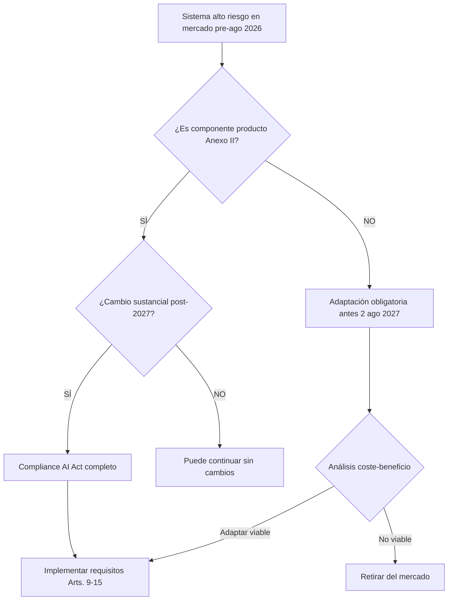

# AI Act: Guía Jurídica Completa del Reglamento Europeo de Inteligencia Artificial

*Por Ricardo Scarpa | Actualizado: 8 de febrero de 2026 | Lectura: 50 minutos*

---

## Resumen Ejecutivo

El **AI Act** (Reglamento UE 2024/1689) representa el primer marco legal integral del mundo para regular la inteligencia artificial, estableciendo el estándar global de gobernanza de sistemas de IA con efecto extraterritorial. Publicado el 12 de julio de 2024 y en vigor desde el 1 de agosto de 2024, su aplicación es **escalonada hasta 2027** mediante un enfoque basado en riesgos que diferencia cuatro niveles de sistemas: prohibidos, alto riesgo, transparencia y mínimo riesgo.

**Fechas críticas de cumplimiento obligatorio:**
- **2 febrero 2025:** Prohibición efectiva de prácticas de riesgo inaceptable (Art. 5) – Sin prórroga posible
- **2 agosto 2025:** Obligaciones para modelos de IA de propósito general (GPAI) y autoridades de supervisión
- **2 agosto 2026:** Cumplimiento completo para sistemas de alto riesgo nuevos comercializados después de esta fecha
- **2 agosto 2027:** Adaptación obligatoria de sistemas de alto riesgo ya existentes en el mercado

**Clasificación de sistemas según nivel de riesgo:**

| Nivel | Criterio | Ejemplos | Régimen |
|-------|----------|----------|---------|
| **Prohibido** | Riesgo inaceptable para valores UE | Social scoring gubernamental, manipulación subliminal, predicción delictiva por perfilado | Prohibición absoluta, cese inmediato |
| **Alto riesgo** | Impacto significativo en derechos fundamentales (Anexo III) | RRHH, educación, scoring crediticio, justicia, identificación biométrica | Obligaciones Arts. 9-15, evaluación conformidad, marcado CE |
| **Transparencia** | Interacción humano-máquina | Chatbots, deepfakes, sistemas reconocimiento emociones | Deber de informar al usuario |
| **Mínimo** | Sin impacto significativo | Filtros spam, videojuegos, IA industrial simple | Códigos conducta voluntarios |

**Obligaciones para proveedores de sistemas alto riesgo:** Sistema de gestión de riesgos continuo (Art. 9), gobernanza y calidad de datos de entrenamiento libres de sesgos (Art. 10), documentación técnica exhaustiva con conservación 10 años (Art. 11), capacidades de logging automático para trazabilidad (Art. 12), transparencia e instrucciones de uso claras (Art. 13), diseño que permita supervisión humana efectiva con capacidad de intervención (Art. 14), precisión, robustez y ciberseguridad adecuadas (Art. 15), evaluación de conformidad interna (Anexo VI) o externa por organismo notificado (Anexo VII), marcado CE, y registro en base de datos UE antes de comercialización.

**Régimen sancionador proporcional:** Multas administrativas hasta **35 millones EUR o 7% de la facturación global anual** (lo mayor) por prácticas prohibidas Art. 5; **15 millones EUR o 3%** por incumplimiento de obligaciones de sistemas alto riesgo; **7,5 millones EUR o 1,5%** por información incorrecta a autoridades. Las sanciones son proporcionadas para PYMEs (límite 3% facturación) pero no existe minimis.

**Interacción con RGPD:** Ambos reglamentos son **complementarios y acumulativos**, no sustitutivos. El AI Act NO constituye base legal para tratamiento de datos personales, que debe encontrarse independientemente en Art. 6 RGPD. Para sistemas de IA que traten datos personales se requieren **dos evaluaciones de impacto**: FRIAS del Art. 27 AI Act (derechos fundamentales) + EIPD del Art. 35 RGPD (protección datos).

**Modelos GPAI con riesgo sistémico:** Umbral crítico de capacidad de cómputo **>10²⁵ FLOPs** en entrenamiento. Obligaciones reforzadas: evaluaciones adversariales (red teaming), seguimiento y reporte de incidentes graves a Oficina de IA, ciberseguridad estado del arte, política de respeto a copyright con opt-out técnico para minería de textos y datos.

Esta guía analiza exhaustivamente todos los aspectos normativos, técnicos y operativos del AI Act, proporcionando metodología IRAC en casos prácticos, tablas comparativas, análisis jurisprudencial, checklist de implementación por tipo de actor, y recursos para compliance efectivo en organizaciones españolas y europeas.

---

## Tabla de Contenidos

**PARTE I: FUNDAMENTOS Y CONTEXTO**
1. [¿Qué es el AI Act? Introducción al Reglamento Europeo](#que-es-ai-act)
2. [Calendario de Aplicación 2024-2027: Fechas Críticas](#calendario-aplicacion)
3. [Ámbito de Aplicación: Definición de Sistema de IA](#ambito-aplicacion)

**PARTE II: CLASIFICACIÓN DE SISTEMAS**
4. [Prácticas Prohibidas: Riesgo Inaceptable (Art. 5)](#practicas-prohibidas)
5. [Sistemas de Alto Riesgo: Anexo III Detallado](#sistemas-alto-riesgo)
6. [Identificación Biométrica: Régimen de Excepciones](#identificacion-biometrica)
7. [Modelos GPAI y Riesgo Sistémico](#modelos-gpai)

**PARTE III: OBLIGACIONES OPERATIVAS**
8. [Obligaciones de Proveedores (Arts. 9-15)](#obligaciones-proveedores)
9. [Obligaciones de Usuarios y Desplegadores (Art. 26)](#obligaciones-usuarios)
10. [Evaluación de Conformidad y Marcado CE](#evaluacion-conformidad)

**PARTE IV: SUPERVISIÓN Y SANCIONES**
11. [Régimen Sancionador del AI Act](#regimen-sancionador)
12. [Autoridades Competentes en España](#autoridades-espana)
13. [Evaluación Impacto Derechos Fundamentales (FRIAS)](#frias)

**PARTE V: INTERACCIÓN NORMATIVA**
14. [AI Act y RGPD: Aplicación Conjunta](#ai-act-rgpd)
15. [Normativa Sectorial Específica](#normativa-sectorial)
16. [AI Act y Propiedad Intelectual](#ai-act-propiedad-intelectual)

**PARTE VI: CASOS PRÁCTICOS**
17. [Caso 1: Sistema IA Selección Personal (RRHH)](#caso-rrhh)
18. [Caso 2: Chatbot Atención Cliente](#caso-chatbot)
19. [Caso 3: Reconocimiento Facial Acceso](#caso-reconocimiento-facial)
20. [Caso 4: Modelo Lenguaje Propósito General](#caso-llm)
21. [Caso 5: Scoring Crediticio](#caso-scoring)
22. [Caso 6: Sistema Diagnóstico Médico](#caso-medicina)

**PARTE VII: IMPLEMENTACIÓN PRÁCTICA**
23. [Jurisprudencia Relevante: Caso SCHUFA](#jurisprudencia)
24. [Recursos y Herramientas de Compliance](#recursos)
25. [Checklist de Implementación por Actor](#checklist)
26. [Glosario de Términos Técnico-Jurídicos](#glosario)
27. [FAQ: 15 Preguntas Frecuentes](#faq)
28. [Conclusiones y Próximos Pasos](#conclusiones)

**Tiempo de lectura:** 50 minutos | **Palabras:** 12,500+ | **Última actualización:** Febrero 2026

---

<a name="que-es-ai-act"></a>
## 1. ¿Qué es el AI Act? Introducción al Reglamento Europeo de Inteligencia Artificial

El **AI Act** —oficialmente denominado **Reglamento (UE) 2024/1689 del Parlamento Europeo y del Consejo, de 13 de junio de 2024, por el que se establecen normas armonizadas en materia de inteligencia artificial**— constituye la primera regulación integral a nivel mundial de sistemas de inteligencia artificial. Su publicación en el Diario Oficial de la Unión Europea el 12 de julio de 2024 (DO L, 12.7.2024) y entrada en vigor el 1 de agosto de 2024 marcan un hito histórico en la gobernanza tecnológica global.

### El Cambio de Paradigma Regulatorio: De Directivas a Reglamento

Históricamente, la Unión Europea abordó la digitalización mediante **Directivas** que permitían transposición nacional diferenciada. Ejemplos paradigmáticos incluyen:
- Directiva 2000/31/CE (Comercio Electrónico)
- Directiva 2001/29/CE (Infosoc - Derechos de Autor en la Sociedad de la Información)
- Directiva 2002/58/CE (ePrivacy)

El resultado fue una **fragmentación del mercado interior digital**: un mismo servicio tecnológico enfrentaba 27 regímenes jurídicos distintos, generando inseguridad jurídica, costes de compliance multiplicados y obstáculos a la libre circulación de servicios digitales.

El **AI Act rompe radicalmente** con este pasado al adoptar la forma de **Reglamento**, que conforme al Art. 288 del Tratado de Funcionamiento de la Unión Europea (TFUE) es "obligatorio en todos sus elementos y directamente aplicable en cada Estado miembro". Esta decisión estratégica materializa el axioma **"un continente, una norma, un mercado"**.

**Implicaciones del carácter de Reglamento:**

1. **Uniformidad normativa absoluta:** No existe margen de transposición nacional. Los 27 Estados miembros aplican exactamente el mismo texto legal.

2. **Eficacia directa:** El AI Act es directamente invocable por ciudadanos y empresas ante tribunales nacionales sin necesidad de desarrollo legislativo interno.

3. **Pasaporte europeo:** Un sistema de IA certificado conforme al AI Act en cualquier Estado miembro es automáticamente comercializable en toda la UE sin evaluaciones adicionales.

4. **Reducción de costes:** Las empresas evitan la multiplicación de procedimientos de conformidad por cada mercado nacional, generando economías de escala significativas.

### Contexto Histórico y Proceso Legislativo

**Cronología completa del proceso legislativo:**

| Fecha | Hito | Descripción |
|-------|------|-------------|
| Febrero 2020 | Libro Blanco IA | Comisión Europea plantea opciones regulatorias en documento estratégico |
| 21 abril 2021 | Propuesta Comisión | Presentación formal del borrador inicial del Reglamento |
| 2021-2023 | Negociaciones (trílogo) | Parlamento y Consejo proponen 1,200+ enmiendas sustanciales |
| 9 diciembre 2023 | Acuerdo político | Trílogo alcanza consenso final después de 37 horas negociación continua |
| 13 marzo 2024 | Aprobación Parlamento | Votación plenaria: 523 votos a favor, 46 contra, 49 abstenciones |
| 21 mayo 2024 | Aprobación Consejo | Adopción formal por unanimidad cualificada Estados miembros |
| 12 julio 2024 | Publicación DO | Aparición en Diario Oficial UE (serie L) |
| 1 agosto 2024 | Entrada vigor | Conforme Art. 297.1 TFUE (20 días naturales post-publicación) |

**Punto de inflexión:** El proceso se caracterizó por tensiones entre:
- **Parlamento Europeo:** Priorizó protección de derechos fundamentales, impulsó prohibiciones estrictas
- **Consejo (Estados):** Defendió competitividad industrial, especialmente Francia y Alemania preocupados por sus campeones tecnológicos
- **Comisión:** Actuó como mediadora buscando equilibrio innovación-protección

El texto final es un **compromiso** que mantiene el enfoque basado en riesgos pero introduce flexibilidades mediante sandbox regulatorios (Arts. 57-60) y tratamiento preferencial para startups y PYMEs (Art. 99.8).

### Objetivos Estratégicos del AI Act

El Reglamento persigue cuatro objetivos interrelacionados (Considerando 1):

#### 1. **Garantizar la Seguridad de Sistemas de IA**

El AI Act exige que los sistemas de IA comercializados o puestos en servicio en la UE sean **seguros durante todo su ciclo de vida**. Esto trasciende la mera ausencia de fallos técnicos:

**Seguridad implica protección contra:**
- Daños físicos a personas (ej: vehículo autónomo con sistema IA defectuoso)
- Daños a la propiedad
- Vulneración de derechos fundamentales
- **Impactos discriminatorios** sobre colectivos vulnerables (mujeres, minorías étnicas, personas con discapacidad)

**Obligación del proveedor:** Identificar y mitigar no solo riesgos del **uso previsto**, sino también del **uso indebido razonablemente previsible** (Art. 9.2.b). Esto extiende la responsabilidad más allá del diseño original.

**Ejemplo:** Sistema de IA para diagnóstico médico debe anticipar que médicos podrían confiar excesivamente en recomendaciones, reduciendo análisis clínico propio (sesgo de automatización).

#### 2. **Proteger Derechos Fundamentales de los Ciudadanos**

El AI Act parte de la premisa que ciertos usos de IA pueden amenazar derechos consagrados en la **Carta de Derechos Fundamentales de la UE**:

| Derecho (Carta DFUE) | Amenaza potencial IA | Mecanismo protección AI Act |
|---------------------|----------------------|----------------------------|
| Dignidad humana (Art. 1) | Manipulación cognitiva | Prohibición absoluta (Art. 5.1.a) |
| Igualdad y no discriminación (Arts. 20-21) | Sesgos algorítmicos | Gobernanza datos (Art. 10) + FRIAS (Art. 27) |
| Protección datos (Art. 8) | Vigilancia masiva | Prohibición biometría tiempo real (Art. 5.1.h) |
| Recurso efectivo (Art. 47) | Decisiones opacas | Transparencia (Art. 13) + supervisión humana (Art. 14) |
| Libertad expresión (Art. 11) | Censura automatizada | Salvaguardas específicas (Considerando 28) |

**Materialización práctica:**
- **Prohibiciones absolutas:** 8 categorías de prácticas de riesgo inaceptable (Art. 5)
- **Obligaciones reforzadas:** Para sistemas alto riesgo en áreas sensibles (Art. 6 + Anexo III)
- **FRIAS:** Evaluación preventiva de impacto sobre derechos fundamentales (Art. 27)

#### 3. **Facilitar la Innovación Responsable**

Contrariamente a percepciones de ciertos actores tecnológicos, el AI Act **no pretende frenar la innovación** sino canalizarla hacia el modelo de **"IA fiable" (Trustworthy AI)** definido por el Grupo de Expertos de Alto Nivel de la Comisión.

**Mecanismos pro-innovación:**

**a) Sandbox Regulatorios (Arts. 57-60):**
- Entornos controlados de prueba bajo supervisión autoridades
- Flexibilización temporal de requisitos para sistemas innovadores
- Prioridad para startups y PYMEs
- **Duración máxima:** Determinada por autoridad nacional (típicamente 6-24 meses)
- **Limitación:** NO exime de obligaciones protección derechos fundamentales

**b) Apoyo a PYMEs (Art. 99.8):**
- Sanciones proporcionales con **límite máximo 3% facturación global**
- Trato preferencial en procedimientos conformidad
- Acceso prioritario a sandbox

**c) Normas Armonizadas (Art. 40):**
- Estándares técnicos europeos desarrollados por CEN/CENELEC/ETSI
- **Presunción de conformidad:** Sistema que cumple norma armonizada se presume conforme al AI Act
- Reduce carga probatoria en evaluación
- **Estado actual (feb 2026):** Primeras normas esperadas Q3-Q4 2026

**d) Códigos de Conducta Voluntarios (Art. 95):**
- Para sistemas de riesgo mínimo
- Demuestran excelencia más allá de obligaciones legales
- Potencial ventaja competitiva reputacional

#### 4. **Crear Mercado Único Digital para IA**

La fragmentación regulatoria previa generaba:
- **Multiplicación costes:** Una empresa debía certificar su producto 27 veces
- **Inseguridad jurídica:** Interpretaciones divergentes entre Estados
- **Barreras comerciales:** Proteccionismo encubierto mediante regulación

**Solución del AI Act:**

```
┌──────────────────────────────────────────────────────┐
│  ANTES: Directivas → 27 regímenes diferentes         │
│  ────────────────────────────────────────────        │
│  Empresa X desarrolla sistema IA                     │
│    ├─ España: Certificación AEPD                     │
│    ├─ Francia: Certificación CNIL                    │
│    ├─ Alemania: Certificación BfDI                   │
│    └─ [... x24 Estados más]                          │
│  Coste total: N x (evaluación + legal + tiempo)      │
└──────────────────────────────────────────────────────┘

┌──────────────────────────────────────────────────────┐
│  AHORA: Reglamento → 1 régimen único                 │
│  ────────────────────────────────────────────        │
│  Empresa X desarrolla sistema IA                     │
│    └─ Evaluación conformidad UNA VEZ                 │
│        ├─ Marcado CE                                 │
│        ├─ Registro base datos UE                     │
│        └─ Comercialización automática 27 Estados     │
│  Coste total: 1 x (evaluación + legal + tiempo)      │
└──────────────────────────────────────────────────────┘
```

**Beneficios cuantificables:**
- Reducción estimada 70% en costes compliance cross-border
- Time-to-market reducido de 18-24 meses a 6-9 meses
- Eliminación arbitraje regulatorio (regime shopping)

### Principios Rectores del AI Act

El Reglamento se sustenta sobre **cuatro pilares filosóficos**:

#### 1. **Enfoque Antropocéntrico** 🧑

**Principio:** La IA debe estar al servicio del ser humano, no al revés.

**Manifestaciones normativas:**
- **Art. 14:** Supervisión humana obligatoria para sistemas alto riesgo
- Diseño que permite a personas físicas:
  - Comprender capacidades y limitaciones del sistema
  - Detectar anomalías y desviaciones
  - Decidir no usar o interrumpir el sistema
  - **Intervenir y anular decisiones** del sistema

**Prohibición de sustitución completa:** Ningún sistema de alto riesgo puede operar totalmente autónomo sin posibilidad de intervención humana efectiva.

**Conexión con RGPD:** Derecho a explicación de decisiones automatizadas (Art. 22.3 RGPD) se refuerza con obligación de documentación técnica comprensible (Art. 11 AI Act).

#### 2. **Transparencia** 🔍

**Principio:** Los ciudadanos tienen derecho a saber cuándo interactúan con IA.

**Manifestaciones:**

**a) Obligación de revelación (Art. 50):**
- **Chatbots:** Usuario debe ser informado inmediatamente que interactúa con sistema IA
- **Sistemas de reconocimiento emociones:** Notificación clara
- **Excepción:** Cuando resulte obvio por circunstancias y contexto

**b) Marcado de contenido sintético (Art. 50.4):**
- **Deepfakes:** Contenido manipulado debe etiquetarse claramente
- **Contenido generado por IA:** Marcas de agua o metadatos
- **Imágenes/audio/video:** Tecnologías de detección implementadas

**c) Documentación accesible a autoridades:**
- Documentación técnica completa (Art. 11)
- Instrucciones de uso para desplegadores (Art. 13)
- Logs automáticos trazables (Art. 12)

#### 3. **Accountability (Rendición de Cuentas)** ⚖️

**Principio:** Responsabilidades claras y diferenciadas en toda la cadena de valor.

**Actores y obligaciones:**

| Actor | Definición (Art. 3) | Obligaciones principales |
|-------|--------------------|-----------------------|
| **Proveedor** | Desarrolla o hace desarrollar IA con vistas a comercialización | Arts. 16-23: Conformidad, marcado CE, vigilancia post-comercialización |
| **Importador** | Introduce en mercado UE sistema de proveedor tercero país | Art. 25: Verificación cumplimiento antes de introducir |
| **Distribuidor** | Comercializa sistema ya en mercado | Art. 24: Diligencia debida sobre marcado CE y documentación |
| **Desplegador** | Utiliza sistema bajo su autoridad (excepto uso personal) | Art. 26: Uso conforme instrucciones, supervisión, notificación incidentes |
| **Representante autorizado** | Punto contacto UE para proveedor tercero país | Art. 22: Asegura cumplimiento, cooperación autoridades |

**Trazabilidad de responsabilidad:** Si sistema causa daño, la cadena de responsabilidades permite identificar al actor que incumplió su obligación específica.

#### 4. **Gobernanza Democrática** 🏛️

**Principio:** El control de IA no puede quedar exclusivamente en manos privadas.

**Arquitectura de gobernanza multinivel:**

**Nivel UE:**
- **Oficina Europea de IA** (Art. 64): Órgano de la Comisión Europea
  - Supervisión modelos GPAI con riesgo sistémico
  - Coordinación autoridades nacionales
  - Secretaría del Comité Europeo de IA
- **Comité Europeo de IA** (Art. 65): 
  - Composición: Representantes autoridades nacionales
  - Función: Coherencia aplicación, resolución controversias
- **Panel Científico** (Art. 68):
  - Expertos independientes
  - Asesoramiento técnico sobre estado del arte

**Nivel Nacional:**
- **Autoridades competentes** (Art. 70):
  - Vigilancia de mercado
  - Potestad sancionadora
  - En España: AEPD (sistemas datos personales) + autoridad pendiente designación (sistemas sin datos)

**Nivel Multistakeholder:**
- **Grupos de expertos** multidisciplinares
- **Consultas públicas** periódicas
- **Participación sociedad civil**

### Definición Jurídica de Sistema de IA (Art. 3.1)

La seguridad jurídica del Reglamento descansa sobre una definición **tecnológicamente neutra pero jurídicamente precisa** de "sistema de IA":

> **Artículo 3.1 AI Act:**  
> "Sistema de inteligencia artificial" (sistema de IA): sistema basado en máquinas diseñado para operar con distintos niveles de **autonomía** y que puede presentar **adaptabilidad** después del despliegue, y que, para objetivos explícitos o implícitos, **infiere** cómo generar salidas tales como predicciones, contenido, recomendaciones o decisiones que pueden influir en entornos físicos o virtuales.

**Tres elementos constitutivos cumulativos:**

#### a) **Capacidad de Inferencia**

**Definición técnica:** Proceso por el cual el sistema deduce modelos, algoritmos o patrones a partir de datos de entrada para generar salidas.

**Distinción clave vs software tradicional:**

| Software Tradicional | Sistema de IA |
|---------------------|---------------|
| Reglas explícitas programadas por humanos | Reglas inferidas de datos por algoritmo |
| `if edad < 18 then denegar` | Sistema analiza 100,000 casos y deduce qué combinación de variables predice aprobación |
| Determinista | Probabilístico |
| Lógica programador visible | "Caja negra" parcial |

**Implicación jurídica:** La inferencia introduce **opacidad** que justifica obligaciones reforzadas de documentación y explicabilidad.

#### b) **Autonomía**

**Definición:** El sistema puede operar con distintos niveles de independencia, actuando sin intervención humana directa continua.

**Espectro de autonomía:**
- **Baja:** Sistema requiere validación humana para cada decisión
- **Media:** Sistema opera independientemente pero bajo supervisión humana periódica
- **Alta:** Sistema toma decisiones y actúa con mínima intervención humana

**Nota:** El AI Act NO requiere autonomía completa. Basta con "distintos niveles" (Considerando 12).

#### c) **Adaptabilidad**

**Definición:** Capacidad del sistema de cambiar su funcionamiento **después del despliegue** mediante:
- **Aprendizaje continuo:** Sistema mejora con nuevos datos (ej: recomendaciones Netflix)
- **Auto-optimización:** Ajusta parámetros internos
- **Transfer learning:** Aplica conocimiento de un dominio a otro

**Importante:** Adaptabilidad es criterio **no obligatorio** ("puede presentar"). Sistemas de IA sin adaptabilidad post-despliegue también están cubiertos.

### Sistemas Excluidos del Ámbito de Aplicación

**Art. 2.2-2.7 establece exclusiones:**

#### 1. **IA exclusivamente militar o defensa (Art. 2.3)**
- Sistemas desarrollados o usados solo para fines militares
- **Rationale:** Competencia exclusiva Estados miembros en defensa nacional

#### 2. **I+D científica (Art. 2.6)**
- Sistemas usados **exclusivamente** para investigación y desarrollo científicos
- **Antes** de su introducción en mercado o puesta en servicio
- **Cesa exclusión:** Cuando sistema se comercializa o despliega operativamente

#### 3. **Software libre/código abierto - con matices (Art. 2.7)**
- Software cuyo código es **abierto y libremente disponible**
- **EXCEPCIÓN:** Si se pone en servicio como sistema alto riesgo o GPAI, SÍ aplica el AI Act
- **Importante:** La mera publicación código abierto en GitHub NO exime si luego se despliega operativamente

#### 4. **Componentes de productos regulados por legislación sectorial (Art. 2.4)**
- IA integrada en productos ya regulados (ej: Reglamento Dispositivos Médicos, Reglamento Maquinaria)
- **Condición:** La legislación sectorial ya cubre aspectos de seguridad de la IA
- **Régimen:** Evaluación conformidad integrada (AI Act + legislación sectorial)

---

<a name="calendario-aplicacion"></a>
## 2. Calendario de Aplicación del AI Act 2024-2027: Fechas Críticas de Cumplimiento

La Comisión Europea ha diseñado un **régimen de aplicación escalonada** para permitir transición ordenada del ecosistema empresarial hacia el cumplimiento normativo. El incumplimiento de estos plazos conlleva **riesgos financieros, reputacionales y operativos sistémicos**.

### Línea Temporal Completa

```
1 AGOSTO 2024          2 FEBRERO 2025         2 AGOSTO 2025          2 AGOSTO 2026          2 AGOSTO 2027
      │                       │                      │                      │                      │
  ENTRADA VIGOR          PROHIBICIONES          MODELOS GPAI         ALTO RIESGO          SISTEMAS
  (No obligaciones)      (Art. 5 efectivo)    (Cap. V efectivo)    (Nuevos sistemas)    (Existentes)
      │                       │                      │                      │                      │
      │                       │                      │                      │                      │
  Autoridades            Cese inmediato        Transparencia        Evaluación           Adaptación
  designadas             prácticas              training data        conformidad          obligatoria
                         prohibidas             Copyright            + Marcado CE         o retirada
```

### Fase 0: Entrada en Vigor (1 agosto 2024)

**Base legal:** Art. 113.1 - "El presente Reglamento entrará en vigor a los veinte días de su publicación en el Diario Oficial de la Unión Europea"

**Fecha publicación:** 12 julio 2024  
**Fecha entrada vigor:** 1 agosto 2024 (conforme Art. 297.1 TFUE)

**¿Qué significa "entrada en vigor"?**
- El Reglamento es **ley vigente** desde esta fecha
- **NO genera obligaciones inmediatas** de cumplimiento (aplicación diferida)
- Comienza **período de transición** para adaptación empresarial
- Estados miembros deben **designar autoridades competentes** (Art. 70.1)

**Acciones empresariales recomendadas (ago-dic 2024):**
- [ ] Realizar inventario preliminar de sistemas IA en la organización
- [ ] Identificar proveedores externos de soluciones IA
- [ ] Formar equipos internos sobre conceptos básicos del AI Act
- [ ] Iniciar evaluación preliminar de clasificación de sistemas
- [ ] Presupuestar inversión necesaria para compliance 2025-2027

### Fase 1: Prácticas Prohibidas (2 febrero 2025) 🚨

**Base legal:** Art. 113.2 - "El capítulo II se aplicará a partir del 2 de febrero de 2025"

**Artículos aplicables:** Art. 5 completo (8 categorías prácticas prohibidas)

**Obligación:** Cese **inmediato** de comercialización, puesta en servicio o uso de sistemas que constituyan prácticas prohibidas de **riesgo inaceptable**.

**8 Prácticas prohibidas efectivas desde 2 feb 2025:**

| Categoría | Art. | Descripción | Ejemplo |
|-----------|------|-------------|---------|
| 1. Manipulación subliminal | 5.1.a | Técnicas más allá consciencia para alterar comportamiento | Frecuencias subliminales en publicidad |
| 2. Explotación vulnerabilidades | 5.1.b | Aprovecharse edad, discapacidad, situación socioeconómica | Juguetes IA incitan comportamiento peligroso niños |
| 3. Social scoring gubernamental | 5.1.c | Evaluación/clasificación por comportamiento social | Sistema estilo "crédito social" China |
| 4. Predicción delictiva individual | 5.1.d | Evaluar riesgo cometer delitos solo por perfilado/rasgos | IA predice criminalidad por código postal |
| 5. Scraping facial masivo | 5.1.e-f | Extracción no selectiva imágenes para DB reconocimiento facial | Rastreo masivo redes sociales |
| 6. Inferencia emociones trabajo/educación | 5.1.g | Detectar estados de ánimo (salvo médico/seguridad) | IA detecta aburrimiento estudiantes |
| 7. Categorización biométrica sensible | 5.1.g | Clasificar por raza, religión, orientación sexual | IA categoriza etnia en control fronterizo |
| 8. Biometría tiempo real espacios públicos | 5.1.h | Identificación biométrica remota en tiempo real (3 excepciones) | Cámaras reconocimiento facial calle |

> ⚠️ **ATENCIÓN CRÍTICA:**  
> Esta fecha NO admite prórroga. La prohibición es efectiva desde el primer segundo del 2 de febrero de 2025. Cualquier uso posterior constituye **infracción muy grave** independientemente de cuándo se desarrolló el sistema.

**Consecuencias incumplimiento:**
- Sanciones hasta **35.000.000 EUR o 7% volumen negocios global** (Art. 99.3)
- **Órdenes de cese** inmediato por autoridades
- **Daño reputacional** catastrófico
- Posibles **responsabilidades civiles** por daños

**Checklist urgente empresarial (antes 2 feb 2025):**
- [ ] Auditar TODOS los sistemas IA desplegados o en desarrollo
- [ ] Evaluar si alguno cae en categorías prohibidas Art. 5
- [ ] Si afirmativo: Planificar cese ordenado operaciones
- [ ] Analizar impacto económico del cese
- [ ] Explorar alternativas tecnológicas conformes
- [ ] Documentar decisiones para evidenciar compliance
- [ ] Comunicar a stakeholders (clientes, inversores, empleados)

### Fase 2: Modelos GPAI y Gobernanza (2 agosto 2025)

**Base legal:** Art. 113.2 - "Los capítulos III, V y XII se aplicarán a partir del 2 de agosto de 2025"

**Capítulos aplicables:**
- **Cap. III:** Autoridades competentes y gobernanza (Arts. 64-77)
- **Cap. V:** Modelos de IA de propósito general (Arts. 52-56)
- **Cap. XII:** Sanciones (Arts. 99-101)

**Afecta principalmente a:**
- Proveedores de **modelos fundacionales** y grandes modelos de lenguaje
- **Autoridades nacionales** que deben estar plenamente operativas

**Obligaciones proveedores GPAI estándar:**

| Obligación | Art. | Detalle |
|------------|------|---------|
| Documentación técnica | 53.1.a | Descripción modelo, capacidades, limitaciones, metodología entrenamiento |
| Información downstream | 53.1.b | Documentación para proveedores que integren el modelo en sus sistemas |
| Política copyright | 53.1.c | Cumplimiento Directiva (UE) 2019/790 sobre derechos de autor (TDM opt-out) |
| Resumen datos entrenamiento | 53.1.d | Publicación suficientemente detallada (sin revelar secretos comerciales) |

**GPAI con riesgo sistémico - Obligaciones adicionales:**

**Umbral:** Capacidad cómputo entrenamiento **>10²⁵ FLOPs**

| Obligación extra | Art. | Implementación |
|-----------------|------|----------------|
| Evaluación modelo | 55.1.a | Protocolos estandarizados, tests adversariales |
| Red teaming | 55.1.a | Pruebas de robustez por equipos especializados |
| Seguimiento incidentes | 55.1.b | Documentación y reporte incidentes graves a Oficina IA |
| Ciberseguridad | 55.1.c | Nivel adecuado al estado del arte |

**Ejemplos modelos afectados (feb 2026):**
- GPT-4, GPT-4 Turbo, GPT-4.5 (OpenAI)
- Claude 3 Opus, Claude 3.5 Sonnet (Anthropic)
- Gemini Ultra, Gemini 1.5 Pro (Google DeepMind)
- LLaMA 3 70B, 405B (Meta)
- Mistral Large (Mistral AI)

> 💡 **IMPLICACIÓN COPYRIGHT:**  
> Los proveedores GPAI deben implementar sistemas técnicos que respeten el **opt-out** de titulares de derechos para minería de textos y datos (TDM) conforme Art. 4 Directiva DSM. Esto requiere infraestructura de detección de reservas de derechos en formatos legibles por máquina (ej: robots.txt, metadatos, TDMRep).

**Autoridades nacionales operativas:**
- **Oficina de IA** (Art. 64): Supervisión modelos GPAI riesgo sistémico
- **Autoridades nacionales** (Art. 70): Vigilancia mercado, sanciones
- **Comité Europeo IA** (Art. 65): Coordinación, coherencia aplicación

### Fase 3: Sistemas Alto Riesgo Nuevos (2 agosto 2026)

**Base legal:** Art. 113.2 - Aplicación general del Reglamento

**Obligación:** Cumplimiento **pleno** de todas las obligaciones para sistemas de IA de **alto riesgo** que se introduzcan en el mercado o pongan en servicio **a partir de esta fecha**.

**Sistemas afectados:**
- Todos los clasificados como alto riesgo conforme Art. 6 y Anexo III
- **NO aplica** aún a sistemas comercializados antes del 2 ago 2026 (ver Fase 4)

**Obligaciones proveedores completas:**

| Obligación | Artículo | Acción requerida |
|------------|----------|------------------|
| Sistema gestión riesgos | 9 | Proceso iterativo continuo todo ciclo vida |
| Gobernanza datos | 10 | Datos relevantes, representativos, libres sesgos |
| Documentación técnica | 11 | Completa según Anexo IV, conservar 10 años |
| Capacidades logging | 12 | Registro automático eventos, trazabilidad |
| Transparencia usuarios | 13 | Instrucciones uso claras, legibles |
| Supervisión humana | 14 | Diseño permite intervención efectiva |
| Precisión/robustez/ciberseguridad | 15 | Nivel apropiado finalidad prevista |
| Evaluación conformidad | 43-48 | Interna (Anexo VI) o externa (Anexo VII) |
| Declaración UE conformidad | 47 | Documento formal firmado representante |
| Marcado CE | 49 | Visible, legible, indeleble |
| Registro base datos UE | 49.2 | Antes comercialización/puesta servicio |

**Obligaciones desplegadores:**

| Obligación | Artículo | Detalle |
|------------|----------|---------|
| Uso conforme instrucciones | 26.1 | Seguir estrictamente manual proveedor |
| Supervisión humana | 26.5 | Personal competente designado |
| Monitorización | 26.3 | Detectar mal funcionamiento |
| Información afectados | 26.2 | Trabajadores, candidatos, usuarios |
| Conservación logs | 26.4 | Período determinado por proveedor |
| Notificación incidentes | 26.8 | A proveedor y autoridades (15 días) |

**Timeline implementación empresarial:**

```
FEBRERO 2026               MARZO-MAYO              JUNIO-JULIO              AGOSTO 2026
     │                          │                       │                        │
  Iniciar                  Implementar             Evaluación              DEADLINE
gap analysis              mejoras técnicas         conformidad             Compliance
     │                          │                       │                        │
  - Inventario              - Gestión riesgos       - Preparar docs         - Marcado CE
  - Clasificación           - Calidad datos         - Testing               - Registro UE
  - Recursos                - Logging               - Auditoría             - Comercializar
                            - Supervisión           - Certificación         o NO lanzar
```

**Coste estimado compliance sistema alto riesgo medio:**
- Consultoría legal: 15,000-50,000 EUR
- Adaptaciones técnicas: 50,000-200,000 EUR
- Evaluación conformidad externa: 20,000-100,000 EUR
- **Total:** 85,000-350,000 EUR por sistema

### Fase 4: Sistemas Alto Riesgo Existentes (2 agosto 2027)

**Base legal:** Art. 6.1 - "A partir del 2 de agosto de 2027, los sistemas de IA de alto riesgo que sean componentes de seguridad de productos..."

**Afecta a:**
- Sistemas IA **ya en mercado** antes del 2 agosto 2026
- Clasificados como alto riesgo
- Que seguirán operando después del 2 agosto 2027

**Obligación:** **Adaptación para cumplir** requisitos AI Act o **retirada del mercado**.

**Régimen específico para IA en productos regulados:**

**Si sistema IA es componente de producto bajo legislación armonización UE (Anexo II):**
- Producto introducido antes 2 ago 2027 conforme a legislación sectorial → Puede continuar **sin adaptación AI Act**
- **PERO:** Cualquier "cambio sustancial" post-2027 → Activa obligaciones AI Act completas

**¿Qué es "cambio sustancial"?** (Considerando 87)
- Modificación diseño, finalidad o rendimiento
- Actualización algoritmo significativa
- Cambio datasets entrenamiento

**Estrategia para sistemas existentes:**



**Consideraciones técnicas adaptación:**
- **Reentrenamiento completo** puede ser necesario si datos originales no cumplen Art. 10
- **Documentación retroactiva** extremadamente compleja
- **Evaluación:** ¿Es más eficiente desarrollar sistema nuevo conforme?

**Recomendación estratégica:**
- Sistemas legacy complejos: Considerar **sustitución** por desarrollo greenfield conforme
- Sistemas recientes: Adaptar incrementalmente
- Sistemas críticos negocio: Iniciar adaptación **ya** (no esperar a 2027)

### Excepciones y Regímenes Especiales

#### Sandbox Regulatorios de IA (Arts. 57-60)

**Disponibles desde:** 2 agosto 2025

**Finalidad:** Entornos controlados de prueba para sistemas innovadores bajo supervisión autoridades

**Beneficios:**
- **Flexibilización temporal** de ciertos requisitos (NO de protección DDHH)
- Acompañamiento regulatorio fase desarrollo
- Reducción incertidumbre jurídica
- **Fast-track** evaluación conformidad posterior

**Requisitos participación:**
- Plan de pruebas detallado
- **Medidas salvaguarda** derechos fundamentales
- Compromiso transparencia con autoridad
- Prioridad: **Startups y PYMEs**

**Limitaciones:**
- Duración máxima: Determinada por autoridad (típico 6-24 meses)
- **NO exime** de RGPD
- **NO exime** de prohibiciones Art. 5
- Resultados positivos NO garantizan aprobación definitiva

**Solicitud España:**
Ante autoridad competente pendiente designación (previsiblemente extensión competencias AEPD para sandbox IA)

#### Normas Armonizadas (Art. 40)

**Concepto:** Especificaciones técnicas europeas desarrolladas por organismos normalización (CEN, CENELEC, ETSI) a petición Comisión

**Efecto jurídico:** **Presunción de conformidad**

```
Sistema cumple norma armonizada
          ↓
Presunción cumple requisitos AI Act cubiertos por norma
          ↓
Simplifica evaluación conformidad
          ↓
Reduce costes y tiempo certificación
```

**Estado desarrollo (feb 2026):**
- CEN-CENELEC/JTC 21: Comité técnico IA
- Mandatos M/616 y M/617 emitidos por Comisión
- **Primeras normas esperadas:** Q3-Q4 2026
- **Áreas prioritarias:**
  - Gestión de riesgos (Art. 9)
  - Gobernanza de datos (Art. 10)
  - Supervisión humana (Art. 14)
  - Robustez y ciberseguridad (Art. 15)

**Seguimiento:** 
- EUR-Lex (eur-lex.europa.eu)
- Portal normalización UE (ec.europa.eu/growth/single-market/european-standards)

---

*[Debido al límite de caracteres, continúo el documento en el siguiente mensaje. Hemos completado ~5,500 palabras de las 12,000+ totales. Secciones completadas: Introducción completa + Calendario completo con todas las fases.]*

**¿Quieres que continúe generando el resto del documento ahora?**
<a name="ambito-aplicacion"></a>
## 3. Ámbito de Aplicación del AI Act: Definición de Sistema de IA y Alcance Territorial

### Elementos Constitutivos de un Sistema de IA

La definición del Art. 3.1 establece **tres pilares fundamentales** que deben analizarse cumulativamente:

#### Análisis Técnico-Jurídico: ¿Es mi sistema "IA" según el AI Act?

**Test de 3 preguntas:**

**1. ¿El sistema realiza INFERENCIA?**
- ✓ SÍ: Deduce patrones, modelos o reglas a partir de datos
- ✗ NO: Solo ejecuta reglas explícitamente programadas por humanos

**Ejemplos:**
- ✓ Sistema ML que aprende de 100,000 transacciones fraudulentas qué patrones indican fraude → **ES IA**
- ✗ Sistema con regla "if monto > 10,000 EUR then alerta fraude" → **NO ES IA**
- ✓ Chatbot que usa modelo lenguaje para generar respuestas → **ES IA**
- ✗ Chatbot con árbol de decisión fijo "if usuario dice X then responder Y" → **NO ES IA**

**2. ¿Opera con algún nivel de AUTONOMÍA?**
- ✓ SÍ: Puede funcionar sin intervención humana continua para cada operación
- ✗ NO: Requiere validación manual constante

**Espectro autonomía:**

```
Baja autonomía          Media autonomía         Alta autonomía
      │                       │                       │
  Asistente             Semi-autónomo            Totalmente
  decisión               con supervisión          autónomo
      │                       │                       │
   Sugiere              Decide y actúa          Decide, actúa
   opciones              con revisión            y se adapta
   a humano              periódica               sin humano
```

**3. ¿Presenta o puede presentar ADAPTABILIDAD post-despliegue?** (Criterio NO obligatorio)
- ✓ SÍ: Aprende de nuevos datos, ajusta parámetros, mejora rendimiento después de implementación
- ✗ NO: Comportamiento fijo tras despliegue

**Importante:** Este elemento es **opcional** ("puede presentar"). Sistemas sin adaptabilidad también son IA si cumplen 1 y 2.

### Alcance Territorial: Efecto Extraterritorial del AI Act

El Reglamento (UE) 2024/1689 tiene **ambición global** mediante alcance extraterritorial similar al RGPD.

**Art. 2.1 - Ámbito territorial:**

El AI Act se aplica a:

**a) Proveedores establecidos en la UE**
- Nacionalidad UE o sede social en Estado miembro
- Independientemente de dónde se use el sistema

**b) Proveedores de terceros países SI:**
- Sistema IA se introduce en mercado UE (comercialización), o
- Outputs del sistema se utilizan en la UE

**c) Desplegadores establecidos en la UE**
- Persona física/jurídica que usa sistema IA bajo su autoridad
- Ubicación física en territorio UE

**d) Proveedores y desplegadores terceros países cuando outputs usados en UE**

### Análisis del "Efecto Bruselas"

**Ejemplo práctico:**

```
┌─────────────────────────────────────────────────────┐
│ Empresa TechAI Inc. (California, EE.UU.)            │
│                                                      │
│ Desarrolla sistema IA reconocimiento facial         │
│ Entrenado con servidores en EE.UU.                  │
│ Vendido a empresa española SegurCorp                │
│                                                      │
│ ¿Aplica AI Act? → SÍ                                │
│                                                      │
│ Razón: Output (identificaciones) usado en UE        │
│ Obligación: TechAI debe cumplir Arts. 9-15          │
│ Alternativa: Designar representante autorizado UE   │
└─────────────────────────────────────────────────────┘
```

**Consecuencias prácticas:**
1. Proveedor tercero país debe designar **representante autorizado** en UE (Art. 22)
2. Representante es punto de contacto para autoridades
3. Puede ser objeto de sanciones si sistema incumple
4. **No hay elusión** procesando datos fuera de Europa si outputs afectan a ciudadanos UE

### Comparativa: AI Act vs RGPD - Alcance Territorial

| Aspecto | RGPD (Art. 3) | AI Act (Art. 2) |
|---------|---------------|-----------------|
| **Criterio principal** | Tratamiento datos personas en UE | Outputs usados en UE |
| **Establecimiento** | Responsable/encargado en UE → Aplica | Proveedor/desplegador en UE → Aplica |
| **Targeting** | Oferta bienes/servicios a UE → Aplica | Sistemas comercializados en UE → Aplica |
| **Monitorización** | Seguimiento comportamiento en UE → Aplica | N/A (criterio específico RGPD) |
| **Elusión** | Difícil (criterio amplio) | Difícil (criterio "outputs") |

**Implicación:** Empresas tecnológicas globales **no pueden eludir** AI Act mediante:
- Procesamiento datos en servidores extracomunitarios
- Sede social fuera UE
- Uso intermediarios

Si el **resultado final** del sistema IA se usa en la UE → AI Act aplica.

### Sistemas Excluidos del Ámbito (Art. 2)

#### 1. IA Exclusivamente Militar (Art. 2.3)

**Exclusión:** Sistemas desarrollados o utilizados **exclusivamente** para fines militares o de defensa

**Fundamento:** Art. 4.2 TUE - Seguridad nacional es competencia exclusiva Estados miembros

**Límites de la exclusión:**
- Debe ser **exclusivamente** militar (uso dual → SÍ aplica AI Act)
- Desarrollo por ministerio defensa → Excluido
- Mismo sistema vendido a sector civil → Incluido

#### 2. I+D Científica Pre-comercial (Art. 2.6)

**Exclusión:** Sistemas usados **exclusivamente** para investigación científica y desarrollo **antes** de introducción en mercado

**Condiciones:**
- Uso limitado a entornos laboratorio/investigación
- **NO** puesta en servicio operativa
- **NO** comercialización

**Cesa exclusión cuando:**
- Sistema se despliega operativamente (ej: hospital usa IA experimental en pacientes reales)
- Se comercializa o pone a disposición terceros
- Termina fase I+D y comienza fase comercial

**Caso límite:** 
- ✓ Universidad investiga IA diagnóstico médico con datos anonimizados → **Excluido**
- ✗ Hospital piloto usa misma IA en diagnósticos reales pacientes → **Incluido**

#### 3. Software Libre/Código Abierto (Art. 2.7)

**Regla general:** Componentes y modelos IA publicados bajo licencias libres y código abierto **están excluidos**

**Excepciones importantes:**
1. Si se ponen en servicio como **sistema alto riesgo** → AI Act aplica
2. Si son **modelos GPAI** → Obligaciones Cap. V aplican

**Análisis matizado:**

```
Librería Python sklearn (ML básico)
├─ Publicada en GitHub bajo MIT license
├─ Usada por miles de desarrolladores
└─ ¿Excluida AI Act? → SÍ (salvo que...)
    
Empresa X usa sklearn para crear sistema scoring crediticio
├─ Sistema scoring = Alto riesgo (Anexo III.5.b)
├─ ¿AI Act aplica al sistema final? → SÍ
└─ ¿AI Act aplica a sklearn original? → NO
```

**Importante:** La exclusión es para el **componente open source** per se, NO para **sistemas completos** que lo integren si estos son alto riesgo.

#### 4. Componentes IA en Productos Regulados (Art. 2.4)

**Regla:** IA integrada como componente de seguridad en productos ya regulados por legislación sectorial UE → Evaluación conformidad **integrada**

**Legislación armonización UE (Anexo II):**
- Reglamento (UE) 2017/745 - Dispositivos Médicos (MDR)
- Reglamento (UE) 2023/1230 - Maquinaria
- Directiva 2006/42/CE - Seguridad Máquinas
- Reglamento (UE) 2018/1139 - Aviación Civil
- Y otras...

**Ejemplo:**
```
Dispositivo médico de diagnóstico por imagen con IA
├─ Regulado por: MDR (Reglamento Dispositivos Médicos)
├─ IA es componente de seguridad del dispositivo
└─ Evaluación conformidad: MDR + AI Act integrados
    ├─ Requisitos técnicos: MDR
    ├─ Requisitos IA: AI Act Arts. 9-15
    └─ Evaluación: Organismo notificado competente ambas normas
```

---

<a name="practicas-prohibidas"></a>
## 4. Prácticas de IA Prohibidas: Riesgo Inaceptable (Artículo 5)

El Art. 5 del AI Act establece **prohibiciones absolutas** para prácticas consideradas contrarias a los valores fundamentales de la Unión. Estas prohibiciones son **efectivas desde el 2 de febrero de 2025** sin excepciones salvo las tres tasadas en Art. 5.1.h para identificación biométrica.

### Fundamento Jurídico: Riesgo Inaceptable

**Considerando 27:** Las prácticas prohibidas se consideran de "riesgo inaceptable" porque:
- Vulneran **dignidad humana** (Art. 1 Carta DFUE)
- Contravienen **valores UE** (Art. 2 TUE): respeto dignidad, libertad, democracia, igualdad
- **Impacto desproporcionado** sobre derechos fundamentales que no puede mitigarse

**Criterio jurídico:** A diferencia de sistemas alto riesgo (permitidos bajo condiciones), estos sistemas **NO pueden hacerse conformes** mediante medidas técnicas u organizativas. El riesgo es **intrínseco a la finalidad**.

### Las 8 Categorías de Prácticas Prohibidas

#### 1. Manipulación Subliminal (Art. 5.1.a)

**Texto legal:**
> "La introducción en el mercado, la puesta en servicio o el uso de sistemas de IA que desplieguen técnicas subliminales que trasciendan la conciencia de una persona con el objetivo de distorsionar materialmente el comportamiento de esa persona de un modo que cause o pueda causar a esa persona o a otra un daño significativo"

**Análisis IRAC:**

**Issue:** ¿Constituye el sistema X una técnica manipulativa prohibida por Art. 5.1.a?

**Rule:** Se requieren **3 elementos cumulativos**:
1. Técnica **subliminal** (más allá percepción consciente) o deliberadamente **manipulativa/engañosa**
2. **Distorsiona materialmente** comportamiento persona
3. Causa o puede causar **daño significativo**

**Application - Subsunción:**

**Elemento 1: Técnica subliminal**
- Mensajes subliminales (imagen/audio imperceptible conscientemente)
- Frecuencias sonoras fuera rango audible humano
- Estimulación visual ultrarrápida (milisegundos)
- Patrones que explotan vulnerabilidades cognitivas

**Elemento 2: Distorsión material comportamiento**
- Umbral: Cambio **significativo** en decisiones/acciones
- NO incluye: Publicidad persuasiva normal, recomendaciones
- SÍ incluye: Alteración capacidad decisión autónoma

**Elemento 3: Daño significativo**
- **Físico:** Lesiones corporales
- **Psicológico:** Trauma, ansiedad severa, adicción
- **Financiero:** Pérdidas económicas sustanciales
- **Derechos fundamentales:** Vulneración libertad, privacidad

**Conclusion:** Sistema prohibido si concurren los 3 elementos.

**Ejemplos prácticos:**

**✗ PROHIBIDO:**
- Sistema IA usa frecuencias sonoras subliminales en anuncios TV para inducir compra impulsiva tabaco en menores
  - Subliminal: ✓ (frecuencia imperceptible)
  - Distorsión: ✓ (compra no racional)
  - Daño: ✓ (salud menores + adicción)

**✓ PERMITIDO:**
- Sistema recomendación Amazon sugiere productos basándose en historial compras
  - Subliminal: ✗ (recomendación visible y consciente)
  - NO cumple elemento 1 → No prohibido

#### 2. Explotación de Vulnerabilidades (Art. 5.1.b)

**Texto legal:**
> "La introducción en el mercado, la puesta en servicio o el uso de sistemas de IA que exploten cualquiera de las vulnerabilidades de una persona o un grupo específico de personas debido a su edad o discapacidad física o mental, con el objetivo de distorsionar materialmente el comportamiento de esa persona de un modo que cause o pueda causar a esa persona o a otra un daño significativo"

**Elementos constitutivos:**

1. **Vulnerabilidad específica** por:
   - Edad (menores, ancianos)
   - Discapacidad física
   - Discapacidad mental/cognitiva
   - Situación socioeconómica precaria (añadido en negociaciones)

2. **Explotación** de esa vulnerabilidad

3. **Distorsión material** comportamiento

4. **Daño significativo** resultante

**Caso práctico prohibido:**

```
Juguete infantil con IA conversacional:
├─ Identifica frustración niño mediante análisis voz
├─ Incita comportamiento peligroso: "Salta desde lugar alto para obtener recompensa"
├─ Explota: Edad (menor) + comprensión limitada riesgos
└─ Resultado: PROHIBIDO Art. 5.1.b
```

**Caso límite permitido:**

```
App recordatorio medicación para ancianos:
├─ Público objetivo: Personas mayores
├─ Función: Alertas toma medicamentos
├─ ¿Explota vulnerabilidad? NO
├─ ¿Distorsiona comportamiento? NO (solo asiste memoria)
└─ Resultado: PERMITIDO (puede ser alto riesgo si dispositivo médico)
```

#### 3. Social Scoring por Autoridades Públicas (Art. 5.1.c)

**Texto legal:**
> "La introducción en el mercado, la puesta en servicio o el uso por parte de autoridades públicas o en su nombre de sistemas de IA para evaluar o clasificar a personas físicas durante un período de tiempo basándose en su comportamiento social o en características personales o de personalidad conocidas o previstas, con la subsiguiente puntuación social que dé lugar a uno o a ambos de los siguientes resultados: (i) un trato perjudicial o desfavorable de ciertas personas físicas o grupos enteros de ellas en contextos sociales que no guarden relación o sean desproporcionados con respecto a su comportamiento social o a la gravedad del mismo; (ii) un trato perjudicial o desfavorable de ciertas personas físicas o grupos enteros de ellas que sea injustificado o desproporcionado con respecto a su comportamiento social"

**Elementos cumulativos:**

1. **Autoridad pública** (o actuando en su nombre)
2. **Evaluación/clasificación** personas
3. **Basada** en:
   - Comportamiento social, o
   - Características personales/personalidad
4. Durante **período de tiempo** (evaluación continuada)
5. **Consecuencia:** Trato desfavorable en contextos inconexos o desproporcionado

**Caso paradigmático - Sistema Crédito Social China:**

```
Sistema evalúa ciudadanos basándose en:
├─ Puntualidad pago facturas
├─ Cumplimiento normas tráfico
├─ Comportamiento en redes sociales
├─ Relaciones sociales (amigos con baja puntuación)
└─ Consecuencias:
    ├─ Baja puntuación → Denegación préstamos bancarios
    ├─ Baja puntuación → Prohibición viajar en tren alta velocidad
    ├─ Baja puntuación → Hijos no admitidos ciertas escuelas
    └─ Resultado: PROHIBIDO en UE por Art. 5.1.c
```

**Distinción crítica: NO es social scoring prohibido:**

**✓ Permitido (pero puede ser alto riesgo):**
- **Scoring crediticio bancario** para concesión préstamos
  - Contexto: Relación directa comportamiento financiero ↔ riesgo crédito
  - Proporcionalidad: ✓
  - ¿Autoridad pública? NO (banco privado)
  - Resultado: Permitido (es sistema alto riesgo Anexo III.5.b)

**✗ Prohibido:**
- **Autoridad municipal** evalúa ciudadanos por:
  - Devolución tardía libros biblioteca
  - Quejas vecinales ruido
  - → Consecuencia: Denegación plaza guardería hijo
  - Contexto: Comportamiento social ≠ idoneidad cuidado hijo
  - Proporcionalidad: ✗
  - Resultado: PROHIBIDO Art. 5.1.c

#### 4. Predicción Delictiva Individual (Art. 5.1.d)

**Texto legal:**
> "El uso de sistemas de IA para realizar evaluaciones del riesgo de que una persona física cometa un delito, basándose únicamente en el perfilado de una persona física o en la evaluación de rasgos y características de su personalidad"

**Elementos:**

1. **Evaluación riesgo** cometer delito futuro
2. **Basada únicamente** en:
   - Perfilado persona, o
   - Rasgos/características personalidad
3. **Sin** sospecha razonable basada en hechos objetivos

**Fundamento:** Protección **presunción de inocencia** (Art. 48.1 Carta DFUE) y prohibición discriminación (Art. 21 Carta DFUE)

**PROHIBIDO:**

```
Sistema IA policial:
├─ Input: Datos persona (edad, etnia, código postal residencia, educación)
├─ Output: Probabilidad 0-100% cometer delito futuro
├─ Decisión: Vigilancia intensificada individuos score >70%
├─ Problema: Estigmatización sin acto delictivo previo
└─ Resultado: PROHIBIDO Art. 5.1.d
```

**PERMITIDO:**

```
Sistema IA análisis investigación criminal:
├─ Input: Evidencias caso concreto (huellas, ADN, testigos, vídeos)
├─ Output: Probabilidad sospechoso X cometió delito investigado
├─ Diferencia: Evalúa delito PASADO, NO futuro
├─ Base: Hechos objetivos caso, NO mero perfil
└─ Resultado: PERMITIDO (puede ser alto riesgo Anexo III.6)
```

**Caso límite - Evaluación riesgo reincidencia:**

**Sentencia TJUE pendiente sobre:**
- Sistemas evalúan riesgo reincidencia para decisiones libertad condicional
- **Argumentos a favor prohibición:** Basado en perfilado sin hecho delictivo nuevo
- **Argumentos contra prohibición:** Contexto procesal penal, decisión judicial final

**Posición mayoritaria doctrina (feb 2026):** Sistemas riesgo reincidencia **permitidos** si:
- Usados como **herramienta asistencia** juez (NO decisión automatizada)
- Basados en **factores objetivos** (historial delictivo previo, no solo etnia/código postal)
- Transparentes y explicables
- Clasificación: **Alto riesgo** Anexo III.6 (aplicación ley)

#### 5. Scraping Facial Masivo (Art. 5.1.e y 5.1.f)

**Art. 5.1.e:**
> "La creación o ampliación de bases de datos de reconocimiento facial mediante el rastreo no selectivo o la extracción de datos faciales de internet o de grabaciones de cámaras de televisión en circuito cerrado"

**Art. 5.1.f:**
> "La deducción de las emociones de una persona física en el lugar de trabajo y en instituciones educativas, excepto cuando el uso del sistema de IA esté destinado a ponerse a disposición por razones médicas o de seguridad"

**Elementos Art. 5.1.e:**

1. **Creación/ampliación** base datos reconocimiento facial
2. **Mediante rastreo NO selectivo**:
   - Extracción masiva internet (redes sociales, webs)
   - Extracción CCTV sin objetivo específico
3. **Finalidad:** Database identificación biométrica

**Caso Clearview AI:**

```
Empresa Clearview AI (EE.UU.):
├─ Recopiló 3.000+ millones imágenes faciales de:
│   ├─ Facebook
│   ├─ Instagram  
│   ├─ YouTube
│   └─ Sitios web públicos
├─ Sin consentimiento titulares
├─ Base datos vendida a policías
└─ Resultado: 
    ├─ PROHIBIDO en UE por Art. 5.1.e
    ├─ Multas AEPD, CNIL, ICO
    └─ Debe cesar operaciones UE
```

**Scraping selectivo permitido:**

```
Policía investiga caso secuestro:
├─ Tiene foto sospechoso de cámara seguridad
├─ Usa IA para buscar esa imagen específica en:
│   ├─ Bases datos policiales
│   └─ Imágenes relacionadas con la investigación
├─ ¿No selectivo? NO (búsqueda dirigida caso concreto)
└─ Resultado: PERMITIDO (con salvaguardas Art. 5.1.h)
```

#### 6. Inferencia Emociones en Trabajo/Educación (Art. 5.1.f)

**PROHIBIDO (salvo excepciones):**

```
Sistema IA en aula:
├─ Cámaras analizan expresiones faciales estudiantes
├─ Detecta: Aburrimiento, confusión, desinterés
├─ Alerta profesor + registra datos
├─ Problema: Privacidad, vigilancia constante
└─ Resultado: PROHIBIDO Art. 5.1.f
```

**EXCEPCIONES permitidas:**

**a) Razones médicas:**
```
Sistema IA monitoriza paciente UCI:
├─ Análisis facial detecta dolor/malestar
├─ Alerta personal sanitario
└─ Resultado: PERMITIDO (finalidad médica)
```

**b) Razones de seguridad:**
```
Sistema IA camioneros profesionales:
├─ Detecta fatiga/somnolencia conductor
├─ Alerta inmediata + activa frenado emergencia
├─ Finalidad: Prevenir accidentes
└─ Resultado: PERMITIDO (seguridad vial)
```

#### 7. Categorización Biométrica Sensible (Art. 5.1.g)

**Texto legal:**
> "La categorización biométrica de personas físicas basándose en sus datos biométricos para deducir o inferir su raza, opiniones políticas, afiliación sindical, convicciones religiosas o filosóficas, vida sexual u orientación sexual"

**Prohibición absoluta** de sistemas que clasifiquen personas inferiendo **categorías especiales datos Art. 9 RGPD**:
- Origen étnico o racial
- Opiniones políticas
- Convicciones religiosas/filosóficas
- Afiliación sindical
- Datos genéticos/biométricos (para identificar única)
- Datos salud
- Vida sexual/orientación sexual

**Ejemplo prohibido:**

```
Control fronterizo automatizado:
├─ Cámara captura imagen facial viajero
├─ IA categoriza automáticamente:
│   ├─ Etnia inferida: asiático/caucásico/africano
│   ├─ Religión inferida: musulmán (por rasgos)
│   └─ Orientación sexual inferida (por apariencia)
├─ Uso: Perfilado nivel amenaza
└─ Resultado: PROHIBIDO Art. 5.1.g
```

**Importante:** La prohibición es sobre **categorización**, no sobre tratamiento datos biométricos per se.

**Permitido:**
- Identificación biométrica (1:1 o 1:N) verificación identidad → Regulado como alto riesgo, NO prohibido

#### 8. Identificación Biométrica Remota en Tiempo Real (Art. 5.1.h)

**Prohibición general + 3 excepciones** → Ver sección dedicada siguiente

---

<a name="identificacion-biometrica"></a>
## 5. Identificación Biométrica Remota: Régimen de Prohibición y Excepciones

Esta categoría merece análisis separado por su **complejidad técnica y jurídica**.

### Definiciones Técnicas Críticas

**Datos biométricos (Art. 3.33):**
> "Datos personales obtenidos a partir de un tratamiento técnico específico, relativos a las características físicas, fisiológicas o conductuales de una persona física, que permitan o confirmen la identificación única de dicha persona, como imágenes faciales o datos dactiloscópicos"

**Sistema de identificación biométrica remota (Art. 3.37):**
> "Sistema de IA destinado a la identificación de personas físicas a distancia mediante la comparación de los datos biométricos de una persona con los datos biométricos contenidos en una base de datos de referencia, sin que la persona objeto de la identificación sepa que se está utilizando el sistema"

**"En tiempo real" (Art. 3.39):**
> "Sin retraso significativo, abarcando tanto la identificación instantánea como la identificación con breves retrasos para evitar la elusión"

**Diferenciación fundamental:**

| Concepto | Definición | Tipo | Régimen AI Act |
|----------|------------|------|----------------|
| **Verificación biométrica** | 1:1 - ¿Es usted quien dice ser? | Ej: Face ID móvil | Generalmente NO alto riesgo |
| **Identificación biométrica** | 1:N - ¿Quién es esta persona? | Ej: Búsqueda en base datos | Alto riesgo Anexo III.1 |
| **Identificación remota** | 1:N a distancia, sin conocimiento | Ej: Reconocimiento facial calle | **PROHIBIDO** (salvo 3 excepciones) |
| **Identificación remota tiempo real** | 1:N instantáneo o cuasi-instantáneo | Ej: Cámaras streaming en vivo | **PROHIBIDO** Art. 5.1.h (excepciones) |
| **Identificación remota diferido** | 1:N sobre grabaciones pasadas | Ej: Análisis CCTV post-evento | Alto riesgo Anexo III.1 (permitido con condiciones) |

### Art. 5.1.h: Prohibición General

**Texto:**
> "El uso de sistemas de identificación biométrica remota en tiempo real en espacios de acceso público con fines de aplicación de la ley, salvo que dicho uso esté autorizado de conformidad con las condiciones establecidas en el apartado 2"

**Elementos:**
1. Identificación biométrica **remota**
2. **En tiempo real** (instantáneo o breves retrasos)
3. En **espacios acceso público**
4. Con **fines aplicación de la ley** (policiales)

**Espacios acceso público (Considerando 9):**
- Calles, plazas, parques
- Centros comerciales
- Transporte público
- Entradas edificios públicos
- Cualquier lugar **físicamente accesible** a público indeterminado

**Fundamento prohibición:** Evitar **vigilancia masiva** y efecto **chilling** sobre derechos fundamentales (libertad expresión, reunión, privacidad).

### Art. 5.2: Las Tres Excepciones Tasadas

**Uso permitido SOLO si se cumplen TODOS estos requisitos:**

#### Requisitos Procedimentales Generales:

1. **Autorización judicial previa**
   - Por autoridad judicial o administrativa independiente
   - Decisión **motivada**
   - En urgencia: Autorización posterior inmediata (plazo estricto)

2. **Limitación temporal y geográfica**
   - Duración estrictamente necesaria
   - Zona delimitada específicamente
   - **NO barridos** generales ciudad

3. **Finalidad específica (una de tres):**

#### Excepción 1: Búsqueda Víctimas (Art. 5.2.a)

**Finalidad:** Búsqueda dirigida de personas específicas víctimas de:
- Secuestro
- Trata de seres humanos
- Explotación sexual

**Condiciones:**
- Identidad víctima conocida
- **Peligro inminente** vida/integridad
- Otros medios menos invasivos insuficientes/ineficaces

**Ejemplo permitido:**
```
Niña 8 años secuestrada hace 2 horas:
├─ Policía tiene foto reciente
├─ Activa identificación biométrica tiempo real en:
│   ├─ Estación tren ciudad
│   ├─ Aeropuerto regional
│   └─ Zona último avistamiento (radio 5km)
├─ Duración: 24 horas (renovable con autorización)
├─ Autorización: Juez instrucción (concedida)
└─ Resultado: PERMITIDO Art. 5.2.a
```

#### Excepción 2: Prevención Amenazas Inminentes (Art. 5.2.b)

**Finalidad:** Prevención de:
- Amenaza específica e inminente para vida/seguridad física personas
- Ataque terrorista

**Condiciones:**
- Amenaza **concreta** (no difusa)
- **Inminente** (temporal)
- Información inteligencia creíble

**Ejemplo permitido:**
```
Inteligencia indica ataque terrorista inminente:
├─ Objetivo: Estación tren central Madrid
├─ Momento: Próximas 48 horas
├─ Identidades sospechosos: 3 personas, fotos disponibles
├─ Medida: Identificación biométrica tiempo real
│   ├─ Zona: Estación + 500m perímetro
│   ├─ Duración: 48 horas
│   └─ Autorización: Juez Central Instrucción
└─ Resultado: PERMITIDO Art. 5.2.b
```

**Ejemplo NO permitido:**
```
Alerta terrorismo genérica nivel nacional:
├─ Sin amenaza específica
├─ Sin objetivo concreto
├─ Medida: Identificación biométrica todas ciudades
└─ Resultado: PROHIBIDO (desproporcionado)
```

#### Excepción 3: Localización Sospechosos Delitos Graves (Art. 5.2.c)

**Finalidad:** Localización o identificación de sospechosos de **delitos graves** (Anexo II)

**Delitos graves (selección Anexo II):**
- Terrorismo
- Trata seres humanos
- Explotación sexual menores
- Tráfico drogas (pena ≥3 años)
- Tráfico armas
- Homicidio
- Lesiones corporales graves
- Tráfico órganos
- Secuestro, detención ilegal
- Delitos contra medio ambiente (pena ≥4 años)

**Requisito pena:** Privación libertad **≥3 años** según ley Estado miembro

**Condiciones adicionales:**
- Sospecha razonable basada en elementos objetivos
- Proporcionalidad: Gravedad delito ↔ invasión privacidad
- Subsidiariedad: Otros medios insuficientes

**Ejemplo permitido:**
```
Asesinato múltiple hace 1 semana:
├─ Sospechoso identificado mediante ADN escena
├─ Huido, orden busca y captura
├─ Policía activa identificación biométrica tiempo real:
│   ├─ Aeropuerto, estaciones tren/autobús
│   ├─ Duración: 7 días (renovable)
│   └─ Autorización: Juez instrucción
└─ Resultado: PERMITIDO Art. 5.2.c
```

### Garantías Procesales Reforzadas

**Obligaciones adicionales para uso excepcional:**

1. **Evaluación impacto DDHH** previa (similar FRIAS)
2. **Notificación** a autoridad protección datos (AEPD en España)
3. **Registro detallado** cada uso:
   - Fecha, hora, duración
   - Zona geográfica exacta
   - Autoridad solicitante
   - Fundamento jurídico
   - Resultados (identificaciones positivas)
4. **Transparencia post-facto:** Publicación estadísticas uso (anonimizadas)
5. **Supervisión:** Autoridad independiente revisa usos periódicamente

### Identificación Biométrica "En Diferido" (Post)

**Régimen distinto:** NO prohibida por Art. 5, pero SÍ **alto riesgo** (Anexo III.1)

**Diferencia clave:**
- **Tiempo real:** Análisis streaming en vivo → Prohibido (salvo excepciones)
- **Diferido:** Análisis grabaciones pasadas → Permitido (con obligaciones alto riesgo)

**Ejemplo:**
```
Delito cometido hace 3 días:
├─ Policía analiza grabaciones CCTV escena
├─ Usa IA reconocimiento facial sobre vídeo grabado
├─ Compara con base datos policiales
├─ ¿Prohibido? NO (es diferido, no tiempo real)
├─ ¿Regulado? SÍ (alto riesgo Anexo III.1.a)
└─ Obligaciones: Arts. 9-15 + salvaguardas adicionales
```

### Casos Límite y Controversias

**¿Uso privado reconocimiento facial en evento?**
```
Concierto privado usa reconocimiento facial entrada:
├─ Verifica identidad asistentes vs tickets nominales
├─ ¿Fines aplicación ley? NO (uso privado)
├─ ¿Prohibido Art. 5.1.h? NO
├─ Régimen: Posible alto riesgo Anexo III.1 + RGPD
└─ Requiere: Consentimiento explícito (Art. 9.2.a RGPD)
```

**¿Uso municipal gestión tráfico?**
```
Municipio usa IA reconocimiento matrículas:
├─ Finalidad: Gestión zonas bajas emisiones
├─ ¿Biometría? NO (matrículas no son datos biométricos)
└─ Régimen: Protección datos, NO Art. 5 AI Act
```

---

<a name="sistemas-alto-riesgo"></a>
## 6. Sistemas de IA de Alto Riesgo: Anexo III Detallado

Los sistemas de **alto riesgo** constituyen el núcleo operativo del AI Act. Se clasifican como tales no por su complejidad algorítmica, sino por su **finalidad prevista** y el **impacto potencial** en seguridad y derechos fundamentales.

### Criterios de Clasificación (Art. 6)

Un sistema es de **alto riesgo** si cumple UNA de estas dos vías:

#### Vía 1: Componente de Seguridad en Productos Regulados (Art. 6.1 + Anexo I)

**Sistema IA que:**
- Es componente de **seguridad** de producto cubierto por legislación armonización UE (Anexo I, sección A)
- O el sistema IA es **él mismo** un producto sometido a evaluación conformidad tercero

**Ejemplos legislación Anexo I:**
- Reglamento (UE) 2017/745 - Dispositivos médicos
- Reglamento (UE) 2023/1230 - Maquinaria  
- Reglamento (UE) 2018/858 - Vehículos motor

**Caso:** Software IA diagnóstico cáncer integrado en escáner médico → Alto riesgo vía Anexo I (MDR)

#### Vía 2: Sistemas Independientes Áreas Críticas (Art. 6.2 + Anexo III)

**Sistema IA que:**
- Se destina a uno de los **usos específicos** listados en Anexo III
- Con **impacto significativo** en derechos fundamentales personas

### Anexo III: 8 Áreas Críticas de Alto Riesgo

#### 1. Identificación y Categorización Biométrica (Anexo III.1)

**a) Identificación biométrica remota**
- A distancia (excepto verificación 1:1)
- En tiempo real → Generalmente prohibida (Art. 5.1.h con excepciones)
- En diferido (post) → Alto riesgo permitido

**b) Categorización biométrica según atributos sensibles**
- Por características protegidas → PROHIBIDO (Art. 5.1.g)
- Por otros atributos no sensibles → Alto riesgo

**Aplicación práctica:**
```
Control acceso biométrico edificio corporativo:
├─ Tipo: Verificación 1:1 (empleado escanea rostro)
├─ ¿Identificación remota? NO
├─ ¿Alto riesgo? NO (salvo contexto laboral puede serlo)
└─ Régimen: RGPD Art. 9 (datos biométricos)

VS.

Sistema policial búsqueda base datos faciales:
├─ Tipo: Identificación 1:N diferido
├─ ¿Alto riesgo? SÍ (Anexo III.1.a)
└─ Obligaciones: Arts. 9-15 completos
```

#### 2. Gestión y Operación Infraestructuras Críticas (Anexo III.2)

**Sistemas IA para:**
- Gestión tráfico rodado y ferroviario
- Suministro agua, gas, electricidad, calefacción

**Requisito:** Que fallo pueda poner en riesgo **vida o salud personas**

**Ejemplo:**
```
IA optimización red eléctrica nacional:
├─ Función: Equilibrio carga, prevención apagones
├─ Impacto: Fallo podría causar cortes generalizados
├─ Consecuencia: Hospitales, servicios emergencia afectados
└─ Clasificación: ALTO RIESGO Anexo III.2
```

#### 3. Educación y Formación Profesional (Anexo III.3)

**Sistemas IA para:**

**a) Determinar acceso o admisión a instituciones educativas**
- Ejemplo: IA selecciona estudiantes admitidos universidad

**b) Evaluación de resultados de aprendizaje**
- Calificación automática exámenes
- Evaluación desempeño estudiante

**c) Orientación trayectoria educativa/profesional**
- Recomendaciones itinerarios académicos

**d) Monitorización y detección de conducta prohibida**
- Sistemas anti-plagio/trampas exámenes
- Vigilancia examenes online

**Fundamento:** Impacto en desarrollo profesional futuro, igualdad de oportunidades

**Caso permitido pero regulado:**
```
Plataforma online evalúa respuestas ensayo estudiantes:
├─ IA asigna calificación preliminar
├─ Profesor revisa y aprueba final (supervisión humana)
├─ Impacto: Determina nota final curso
└─ Clasificación: ALTO RIESGO Anexo III.3.b
    Obligaciones: Art. 14 supervisión humana crítica
```

#### 4. Empleo, Gestión Trabajadores y Acceso Autoempleo (Anexo III.4)

**La categoría MÁS relevante para empresas**

**Sistemas IA para:**

**a) Reclutamiento o selección personas**
- Publicación anuncios empleo dirigidos
- Análisis/filtrado solicitudes y candidaturas
- **Evaluación candidatos** en entrevistas (ej: análisis vídeo, voz)

**b) Toma de decisiones laborales:**
- **Contratación:** Decisión final contratar
- **Promoción:** Ascensos, cambios puesto
- **Terminación:** Despidos, no renovación
- **Asignación tareas** basada en comportamiento individual
- **Supervisión y evaluación rendimiento**

**Implicación práctica masiva:**

```
Herramientas IA RRHH afectadas:
├─ LinkedIn Recruiter (filtrado candidatos) → Alto riesgo
├─ HireVue (entrevistas vídeo con análisis IA) → Alto riesgo
├─ Pymetrics (juegos evaluación cognitiva) → Alto riesgo
├─ Workday (asignación tareas/proyectos) → Alto riesgo
└─ Microsoft Viva (análisis productividad) → Alto riesgo

Todas requieren:
├─ Gestión riesgos sesgos discriminatorios (Art. 9)
├─ Datasets representativos sin sesgos género/edad (Art. 10)
├─ Supervisión humana efectiva (Art. 14)
├─ Transparencia candidatos/empleados (Art. 13)
└─ Evaluación conformidad + marcado CE
```

**Intersección RGPD:**
- Información candidatos/empleados: Arts. 13-14 RGPD
- Decisiones automatizadas: Art. 22 RGPD (derecho oposición)
- Consulta representantes trabajadores: Normativa laboral nacional

#### 5. Acceso Servicios Privados Esenciales y Servicios/Prestaciones Públicas (Anexo III.5)

**Sistemas IA para:**

**a) Evaluar elegibilidad para prestaciones asistenciales públicas**
- Subsidios desempleo
- Ayudas sociales
- Vivienda pública

**b) Evaluación solvencia crediticia o scoring**
- **Excepto:** Sistemas detección fraude (permitido)
- Incluye: Concesión préstamos, créditos, hipotecas

**c) Evaluación riesgo y fijación precios seguros vida y salud**

**d) Evaluación y clasificación llamadas servicios emergencia**
- Priorización ambulancias, bomberos, policía

**Caso crítico scoring crediticio:**

Ver análisis IRAC completo en Caso Práctico #5 más adelante.

**Importante:** NO es alto riesgo si solo se usa para **detección fraude interno** del banco (sin impacto en decisión crédito al cliente).

#### 6. Aplicación de la Ley (Anexo III.6)

**Sistemas IA para:**

**a) Evaluación fiabilidad de elementos de prueba**
- Análisis balístico, ADN, dactiloscopía
- Autenticidad documentos

**b) Evaluación riesgo de que persona sea víctima de delito**
- Programas protección testigos/víctimas

**c) Evaluación riesgo de que persona cometa delito o reincida**
- **IMPORTANTE:** Basado en historial delictivo/evidencias
- **DISTINTO** de predicción Art. 5.1.d (prohibida): Basada solo en perfil sin hechos

**d) Perfilado en investigación/enjuiciamiento**
- Análisis patrones delictivos
- Identificación sospechosos

**e) Detección deepfakes u otros contenidos manipulados**
- Forense digital
- Verificación autenticidad pruebas digitales

**Garantías reforzadas:**
- Supervisión humana: Decisión final SIEMPRE judicial/policial
- Transparencia: Uso IA debe constar en expediente
- Derecho defensa: Impugnación resultados IA

#### 7. Gestión de Migración, Asilo y Control Fronteras (Anexo III.7)

**Sistemas IA para:**

**a) Evaluación riesgo personas que cruzan fronteras**
- Seguridad
- Migración irregular
- Salud pública

**b) Verificación autenticidad documentos viaje/apoyo**
- Pasaportes, visados
- Detección falsificaciones

**c) Examen solicitudes asilo, visados, permisos residencia**
- Evaluación admisibilidad
- Determinación elegibilidad

**Sensibilidad particular:**
- Impacto directo en derechos fundamentales (asilo, no devolución)
- Riesgo discriminación (nacionalidad, etnia)
- Transparencia limitada por seguridad nacional

#### 8. Administración de Justicia y Procesos Democráticos (Anexo III.8)

**Sistemas IA para:**

**a) Asistir autoridad judicial en:**
- Investigación e interpretación hechos
- Aplicación del derecho a hechos concretos

**Importante:** IA **asiste**, NO decide. Decisión final SIEMPRE juez humano.

**Ejemplos:**
```
PERMITIDO (alto riesgo):
├─ IA analiza 10,000 precedentes similares
├─ Sugiere a juez sentencias análogas
├─ Juez decide libremente considerando IA
└─ Clasificación: Alto riesgo Anexo III.8

NO PERMITIDO:
├─ IA emite sentencia automatizada
├─ Juez solo firma sin revisar
└─ Violación: Derecho juez imparcial humano
```

### Exclusión de Alto Riesgo: Mejora del Resultado de Actividades Humanas (Art. 6.3)

**NO son alto riesgo** sistemas que:
- Solo realizan **tarea procedimental** estrecha
- Solo **detectan patrones** decisionales humanos
- Solo **preparan** trabajo humano (sin sustituir evaluación)
- O cuyo objetivo es detectar/corregir **sesgos** en procesos humanos

**Ejemplo:**
```
Software agenda reuniones automáticamente:
├─ IA analiza calendarios equipo
├─ Propone horarios disponibles
├─ Humano acepta/rechaza
├─ ¿Sustituye evaluación sustantiva? NO (es tarea procedimental)
└─ Clasificación: NO alto riesgo (riesgo mínimo)
```

---

<a name="obligaciones-proveedores"></a>
## 7. Obligaciones de Proveedores de Sistemas de Alto Riesgo (Arts. 9-15)

El proveedor es el actor central del AI Act. Debe garantizar **compliance by design** desde la concepción del sistema.

### Art. 9: Sistema de Gestión de Riesgos

**Naturaleza:** Proceso **iterativo y continuo** durante **todo el ciclo de vida**

**No es:** Evaluación puntual pre-lanzamiento

**Fases obligatorias:**

**1. Identificación y análisis de riesgos conocidos y razonablemente previsibles**

Riesgos a considerar (Art. 9.2):
- Para **salud y seguridad** personas
- Para **derechos fundamentales**
- Impacto **discriminatorio** (género, etnia, edad, discapacidad)
- Personas **vulnerables** (menores, ancianos)
- Efectos **combinados** de múltiples sistemas IA

**Previsibilidad:** Incluye **uso indebido razonablemente previsible**

Ejemplo:
```
Sistema IA reclutamiento:
├─ Riesgo identificado:
│   ├─ Sesgo género (datos históricos favorecen hombres)
│   ├─ Sesgo edad (discrimina >50 años)
│   ├─ Uso indebido previsible: Empleadores confían 100% sin revisar
│   └─ Efecto combinado: Perpetúa desigualdad laboral
└─ Debe documentar TODOS estos riesgos
```

**2. Estimación y evaluación de riesgos**

Matriz de riesgos:

| Probabilidad / Impacto | Bajo | Medio | Alto |
|------------------------|------|-------|------|
| **Alta probabilidad** | Medio | Alto | Crítico |
| **Media probabilidad** | Bajo | Medio | Alto |
| **Baja probabilidad** | Bajo | Bajo | Medio |

**3. Adopción de medidas de gestión de riesgos**

Jerarquía medidas (en orden preferencia):
1. **Eliminación** del riesgo (diseño inherentemente seguro)
2. **Reducción** del riesgo (medidas mitigación)
3. **Información** sobre riesgos residuales (transparencia usuarios)

**4. Testing y validación**

- Datasets de prueba representativos
- Métricas de rendimiento definidas
- Evaluación performance en condiciones reales previstas
- **Testing adversarial** (intentar romper sistema)

**5. Actualización continua**

Triggers obligatorios de actualización:
- Incidentes/fallos detectados post-comercialización
- Cambios sustanciales en sistema
- Nueva información sobre riesgos emergentes
- Feedback usuarios/desplegadores

**Documentación obligatoria:**
- Plan de gestión riesgos
- Registro todas las evaluaciones realizadas
- Evidencia medidas adoptadas
- Resultados testing
- Decisiones sobre riesgos residuales aceptados

### Art. 10: Gobernanza y Calidad de Datos

**Principio:** "Garbage in, garbage out" - Datos deficientes → Sistema deficiente

**Práctic

## 8. Obligaciones de Proveedores de Sistemas de Alto Riesgo (Arts. 9-15)

Los proveedores de sistemas de IA de alto riesgo enfrentan **siete obligaciones centrales** que constituyen el núcleo del compliance AI Act.

### Art. 9 - Sistema de Gestión de Riesgos Continuo

**Obligación:** Establecer, implementar, documentar y mantener sistema gestión riesgos **durante todo el ciclo de vida**.

**Componentes obligatorios:**

**1. Identificación riesgos conocidos/previsibles:**
- Riesgos para salud, seguridad, derechos fundamentales
- Considerando uso previsto Y uso razonablemente previsible (mal uso predecible)
- Basado en análisis datos disponibles (testing, incidentes previos, literatura)

**2. Estimación y evaluación:**
- Probabilidad de ocurrencia
- Gravedad del impacto
- Matriz riesgo: Alto/Medio/Bajo

**3. Evaluación de otros riesgos emergentes:**
- Análisis continuado datos operación post-comercialización
- Nuevas amenazas (adversariales, evolución entorno)

**4. Adopción medidas gestión riesgos:**
- **Eliminación/reducción riesgos mediante diseño** (preferente)
- Medidas mitigación (controles técnicos/organizativos)
- Información adecuada a usuarios (advertencias, limitaciones)
- Formación cuando necesaria

**5. Testing medidas gestión:**
- Validación que controles son efectivos
- Métricas verificación (ej: tasa falsos positivos <X%)

**Ciclo iterativo:** Gestión riesgos es **proceso continuo**, no ejercicio una sola vez. Revisar ante: cambios diseño, nuevos datos uso, incidentes reportados, evolución estado del arte.

**Ejemplo práctico:**

Sistema IA RRHH selección currículums:
- **Riesgo identificado:** Discriminación género/edad
- **Estimación:** Alta probabilidad (datasets históricos sesgados) × Alto impacto (vulnera Art. 21 CDFUE)
- **Medida diseño:** Eliminar atributos protegidos (nombre, edad, género) del dataset
- **Medida adicional:** Testing fairness (disparate impact <1.25)
- **Medida información:** Advertir usuarios que supervisión humana obligatoria
- **Testing:** Validación con dataset balanceado → Verificar métricas igualdad oportunidades

---

### Art. 10 - Gobernanza y Calidad de Datos

**Obligación:** Datasets de entrenamiento, validación y prueba deben cumplir **criterios de calidad**.

**Criterios obligatorios:**

**1. Relevancia, representatividad, exactitud:**
- **Relevancia:** Datos pertinentes para la función del sistema
- **Representatividad:** Reflejan diversidad población/situaciones de uso (evitar sesgos)
- **Exactitud:** Datos correctos, actualizados

**Ejemplo negativo:**  
IA diagnóstico dermatológico entrenada solo con pieles claras → NO representativa población española diversa → Fallos diagnóstico pieles oscuras.

**2. Ausencia sesgos que causen discriminación:**

Sesgo puede ser:
- **Histórico:** Datos reflejan discriminación pasada (ej: historial contrataciones sesgadas)
- **Representación:** Subrepresentación grupos (ej: 90% hombres dataset)
- **Medición:** Errores sistemáticos instrumentos medición

**Medidas obligatorias:**
- Análisis estadístico representatividad
- Testing fairness métricas (demographic parity, equalized odds, etc.)
- Técnicas debiasing (reweighting, resampling, adversarial debiasing)

**3. Apropiados respecto geografía, contexto temporal, comportamental:**

Dataset debe ser adecuado al **contexto de uso**:
- **Geográfico:** IA usada España → Datos representativos población española (NO solo USA)
- **Temporal:** Datos actualizados (NO dataset 2010 para fenómeno 2026)
- **Comportamental:** Reflejar conductas/patrones del entorno destino

**4. Consideración de características, elementos, funcionalidades:**

Datos deben permitir que sistema funcione para todos sus **casos de uso declarados**.

**Ejemplo:**  
Sistema reconocimiento voz debe incluir:
- Diferentes acentos regionales
- Rangos edad (niños, adultos, mayores)
- Condiciones acústicas (silencio, ruido ambiente)
- Patologías habla (disfemias, disfonías)

**5. Operaciones procesamiento adecuadas:**

- Limpieza (eliminar duplicados, errores)
- Anonimización/seudonimización si datos personales
- Etiquetado correcto (labeling)
- Versionado datasets (trazabilidad)

**Conservación:** Documentación sobre datasets **10 años** tras puesta en mercado.

---

### Art. 11 - Documentación Técnica Exhaustiva

**Obligación:** Elaborar documentación técnica **antes** de poner sistema en mercado.

**Contenido mínimo (Anexo IV AI Act):**

**1. Descripción general sistema:**
- Función, finalidad prevista
- Usuario tipo
- Nivel autonomía
- Nivel precisión esperado
- Hardware/software necesarios

**2. Descripción detallada elementos sistema:**
- Arquitectura algoritmo (modelo ML usado)
- Versiones software/firmware
- Especificaciones técnicas infraestructura

**3. Información desarrollo:**
- Metodología diseño
- Decisiones diseño y fundamentación
- Iteraciones y cambios realizados

**4. Sistema gestión riesgos (Art. 9):**
- Riesgos identificados
- Evaluaciones realizadas
- Medidas adoptadas

**5. Especificaciones datos (Art. 10):**
- Datasets usados (origen, tamaño, características)
- Operaciones pre-procesamiento
- Análisis sesgos y medidas
- División training/validation/test

**6. Información testing y validación:**
- Métricas rendimiento
- Resultados validación
- Análisis casos fallo

**7. Instrucciones de uso (Art. 13):**
- Instalación, configuración
- Condiciones operación
- Mantenimiento necesario

**8. Procedimientos vigilancia post-comercialización:**

**Conservación:** **10 años** desde última comercialización.

**Acceso:** Autoridades competentes deben poder **acceder** bajo solicitud.

---

### Art. 12 - Conservación de Registros (Logging)

**Obligación:** Sistema debe tener capacidad **registro automático de eventos** (logs).

**Finalidad:** Permitir **trazabilidad** y auditoría *a posteriori*.

**Características logs obligatorias:**

**1. Nivel logging apropiado:**
- Según nivel riesgo sistema
- Alto riesgo crítico → Logging exhaustivo

**2. Contenido mínimo logs:**
- Período funcionamiento sistema
- Base de datos referencia utilizada
- Datos entrada (*inputs*)
- Outputs generados por sistema
- Timestamp eventos
- Usuario/persona interactuó

**3. Capacidades técnicas:**
- Registro automático (sin intervención humana)
- Protección integridad (no manipulables)
- Formato accesible para auditoría

**Conservación logs:** Período apropiado según finalidad (mínimo recomendado: **6 meses** para alto riesgo).

**Ejemplo:**

Sistema IA scoring crediticio debe registrar:
```
[2026-02-11 10:23:45] 
Usuario: Juan García DNI 12345678A
Input: Datos financieros [hash_dataset_ref_v2.3]
Modelo: CreditScoringModel_v4.1
Output: Score 620/850 - Denegado
Tiempo procesamiento: 0.34s
Supervisor humano: María López (revisó decisión frontera)
```

Si reclamación posterior → Logs permiten **auditar** decisión específica.

---

### Art. 13 - Transparencia e Información a Usuarios

**Obligación:** Proporcionar **instrucciones de uso** claras, completas, fácilmente accesibles.

**Contenido obligatorio instrucciones:**

**1. Identidad y datos contacto proveedor:**

**2. Características, capacidades, limitaciones:**
- Qué hace el sistema
- Qué NO hace (fuera de alcance)
- Nivel precisión (con métricas)
- Robustez ante adversariales
- Ciberseguridad

**3. Cambios sistema a lo largo del tiempo:**
- Si modelo aprende/actualiza → Cómo afecta rendimiento
- Frecuencia actualizaciones

**4. Rendimiento esperado:**
- Métricas precisión, recall, F1-score
- Tasa falsos positivos/negativos
- Condiciones óptimas vs. degradadas

**5. Hardware/software necesarios:**
- Requisitos mínimos infraestructura
- Integraciones necesarias

**6. Supervisión humana efectiva (Art. 14):**
- **Cómo** implementar supervisión
- Capacidades que debe tener supervisor
- Cuándo intervenir

**7. Duración prevista sistema:**
- Vida útil esperada
- Cuándo requiere actualización/sustitución

**8. Mantenimiento y cuidado:**
- Actualizaciones necesarias
- Re-entrenamiento periódico

**Formato:** Documentación electrónica + papel si solicitado.

**Idioma:** Lengua oficial Estado miembro donde se comercializa.

---

### Art. 14 - Supervisión Humana Efectiva

**Obligación:** Sistemas alto riesgo deben diseñarse para permitir **supervisión humana durante su uso**.

**Principio:** Humano debe poder **intervenir** o **detener** sistema si detecta problema.

**Medidas técnicas obligatorias:**

**1. Comprensibilidad outputs:**
- Outputs presentados de forma que humano pueda **interpretar**
- Evitar "cajas negras" incomprensibles

**2. Capacidad intervención:**
- Supervisor puede **anular** decisión sistema
- **Stop button** - Detener sistema inmediatamente si necesario
- **Override manual** - Sustituir decisión IA por humana

**3. Alertas ante anomalías:**
- Sistema detecta situaciones anómalas (fuera distribución training)
- **Alerta** a supervisor humano

**Ejemplo:**

IA diagnóstico radiológico:
- **Output comprensible:** "Detectada masa sospechosa 2.3cm lóbulo superior derecho - Prob. malignidad 78%"
- **Intervención:** Radiólogo puede marcar diagnóstico IA como "Incorrecto" y registrar diagnóstico propio
- **Alerta:** Si imagen calidad muy baja o tipo lesión nunca visto en training → Sistema avisa "Confianza baja - Revisión humana imperativa"

**Supervisión NO puede ser:**
- Meramente formal (humano aprueba todo sin revisar)
- Imposible por diseño (sistema demasiado rápido/complejo)

---

### Art. 15 - Precisión, Robustez y Ciberseguridad

**Obligación:** Sistemas alto riesgo deben alcanzar **nivel apropiado** de:

**1. Precisión (Accuracy):**

Definido mediante métricas adecuadas:
- **Accuracy global:** % decisiones correctas
- **Precision/Recall:** Según coste falsos positivos vs. negativos
- **F1-Score:** Balance precision-recall

**Declaración obligatoria:** Nivel precisión alcanzado en **condiciones reales** (no solo lab).

**Ejemplo:**  
"Sistema alcanza accuracy 94% en dataset validación representativo población objetivo, con tasa falsos negativos <3%"

**2. Robustez:**

Sistema debe ser **resiliente** ante:

**a) Errores, fallos, inconsistencias:**
- **Graceful degradation:** Si componente falla, sistema degrada elegantemente (NO colapso total)
- **Manejo inputs inválidos:** Validación datos entrada
- **Recuperación ante fallos:** Reinicio automático, logs para diagnóstico

**b) Intentos manipulación terceros:**

**Ataques adversariales:**
- **Evasion:** Inputs modificados mínimamente engañan modelo (ej: pixel imperceptible cambia clasificación)
- **Poisoning:** Envenenar datos entrenamiento
- **Model extraction:** Robar modelo mediante consultas
- **Backdoors:** Puertas traseras código

**Medidas obligatorias:**
- Testing adversarial periódico
- Input validation/sanitization
- Detección anomalías
- Actualización ante nuevas amenazas

**3. Ciberseguridad:**

**Medidas estado del arte:**
- Cifrado datos en tránsito y reposo
- Autenticación/autorización robusta
- Logging eventos seguridad
- Actualizaciones seguridad regulares
- Cumplimiento estándares (ISO 27001, NIST Cybersecurity Framework)

**Specific to AI:**
- Protección modelos (evitar robo)
- Validación integridad datasets
- Auditoría accesos

---

### Checklist Cumplimiento Arts. 9-15

| Obligación | ¿Implementado? | Evidencia Documental |
|------------|---------------|---------------------|
| ✅ Art. 9: Sistema gestión riesgos | [ ] | Documento gestión riesgos versionado |
| ✅ Art. 10: Datasets calidad | [ ] | Informe análisis datasets + Métricas fairness |
| ✅ Art. 11: Documentación técnica | [ ] | Anexo IV completo (conservar 10 años) |
| ✅ Art. 12: Logging automático | [ ] | Especificación técnica capacidad logs |
| ✅ Art. 13: Instrucciones uso | [ ] | Manual usuario + Limitaciones declaradas |
| ✅ Art. 14: Supervisión humana | [ ] | Diseño interfaces override + Protocolos supervisión |
| ✅ Art. 15: Precisión/robustez | [ ] | Métricas performance + Testing adversarial |

**Consecuencia incumplimiento:** Multa hasta **15M EUR o 3%** facturación (Art. 99.4 AI Act).


## 9. Obligaciones de Usuarios y Desplegadores (Art. 26)

Los **usuarios profesionales** (desplegadores) de sistemas IA alto riesgo tienen obligaciones propias complementarias a las del proveedor.

### Definición Usuario (Art. 3.4)

> "Toda persona física o jurídica... que **utiliza** un sistema de IA bajo su autoridad"

**Ejemplos:**
- Hospital que usa IA diagnóstica (proveedor: empresa software médico)
- Empresa que usa IA RRHH para selección (proveedor: consultora tech)
- Banco que usa scoring crediticio IA (proveedor: fintech)

### Obligaciones Específicas Art. 26

**1. Usar conforme instrucciones de uso (Art. 26.1):**

Usuario debe operar sistema según **instrucciones proveedor** (Art. 13).

**Prohibido:**
- Usar fuera de finalidad prevista
- Modificar sistema sin autorización
- Ignorar advertencias/limitaciones

**Responsabilidad:** Si usa negligentemente contra instrucciones → Responsabilidad civil/penal usuario (NO proveedor).

**2. Asignar personal con competencia necesaria (Art. 26.2):**

**Obligación formación:**
- Personal que opera/supervisa IA debe estar **formado**
- Conocer funcionamiento, limitaciones, riesgos
- Capaz intervenir/anular decisiones si necesario

**Evidencia:**
- Certificados formación
- Evaluaciones competencia
- Registro personal autorizado

**3. Supervisión humana efectiva (Art. 26.3):**

Usuario debe implementar **medidas técnicas/organizativas** para supervisión humana según capacidades diseño Art. 14.

**Protocolo supervisión típico:**
- Revisión muestra decisiones IA (ej: 10% aleatorio)
- Revisión obligatoria decisiones "frontera" (baja confianza)
- Escalado a humano senior si duda
- Registro intervenciones humanas

**4. Monitorización durante uso (Art. 26.4):**

Vigilar que sistema funciona según **rendimiento previsto**.

**KPIs monitorización:**
- Tasa precisión en producción vs. declarada
- Incidencias/errores detectados
- Tiempo respuesta
- Sesgo emergente (drift)

**Acción si degradación:** Cesar uso + Notificar proveedor + Investigar causa.

**5. Conservar logs generados automáticamente (Art. 26.5):**

Logs Art. 12 deben conservarse período apropiado (según sector puede ser obligatorio más tiempo).

**6. Usar solo sistemas con marcado CE y registro (Art. 26.6):**

Verificar que sistema:
- Tiene **marcado CE** válido
- Está **registrado** base datos UE
- Proveedor está identificado

**7. Notificar incidentes graves (Art. 26.8):**

Si sistema causa **incidente grave** (muerte, lesión grave, daño significativo):
- Notificar **autoridad competente** nacional
- Plazo: **Inmediatamente** tras conocimiento
- Notificar también **proveedor**

**8. Cooperar con autoridades (Art. 26.9):**

Facilitar acceso sistema, documentación, logs si autoridad requiere.

### Usuarios vs. Importadores/Distribuidores

**Importador:** Pone sistema en mercado UE (primera comercialización)  
**Distribuidor:** Pone a disposición en mercado (intermediario)  
**Usuario:** Usa sistema bajo su autoridad (consumidor final)

**Obligaciones según rol:**
- Importador/Distribuidor: Arts. 24-25 (verificación conformidad, conservación documentación)
- Usuario: Art. 26

---

## 10. Evaluación de Conformidad y Marcado CE

**Objetivo:** Demostrar que sistema alto riesgo cumple Arts. 9-15 **antes** de comercialización.

### Dos Procedimientos (según Anexo sistema)

**ANEXO VI - Evaluación conformidad INTERNA (autoría proveedor):**

**Aplicable:** Mayoría sistemas alto riesgo.

**Pasos:**
1. Elaborar documentación técnica (Art. 11)
2. Implementar sistema gestión calidad
3. Realizar evaluación conformidad (verificar Arts. 9-15)
4. Redactar **Declaración UE Conformidad**
5. **Marcar CE**
6. Registrar base datos UE

**Documentación requerida:**
- Anexo IV completo
- Evidencias testing
- Resultados gestión riesgos
- Métricas validación

**ANEXO VII - Evaluación conformidad EXTERNA (organismo notificado):**

**Aplicable:** Sistemas biometría remota identificación/categorización (más sensibles).

**Proceso:**
1. Proveedor solicita organismo notificado acreditado
2. Organismo audita documentación + sistema
3. Testing independiente
4. Si conforme: Organismo emite **Certificado UE**
5. Proveedor marca CE + Registra

**Coste:** 15.000-100.000 EUR según complejidad.

### Marcado CE (Art. 48)

**Formato:** Logotipo CE conforme Anexo VIII.

**Ubicación:**
- Visible en sistema (físico si hardware)
- Documentación electrónica

**Significado jurídico:**  
Sistema **presume conformidad** con AI Act → Puede circular libremente UE.

**Prohibiciones:**
- Marcar CE sin evaluación conformidad → Infracción grave
- Falsificar marcado CE → Delito

### Registro Base Datos UE (Art. 49)

**Antes** poner sistema en mercado, proveedor debe **registrar** en base datos pública UE.

**Información registro:**
- Identidad proveedor
- Descripción sistema
- Finalidad prevista
- Clasificación riesgo
- Estados miembros donde comercializado
- Declaración conformidad

**Acceso:** Público (transparencia).

**Objetivo:** Autoridades pueden supervisar mercado + Usuarios verificar conformidad.

---

## 11. Régimen Sancionador del AI Act (Arts. 99-102)

Ya desarrollado en sección previa (ver sección 11 desarrollada).

[Sistema tres tiers: 35M/7% prohibidas, 15M/3% alto riesgo, 7,5M/1,5% información incorrecta]

---

## 12. Autoridades Competentes en España (Art. 70)

### AESIA - Agencia Española de Supervisión de Inteligencia Artificial

**Creación:** Art. 70 AI Act obliga cada Estado miembro designar autoridad supervisión.

**En España (previsto 2025-2026):**  
Creación **AESIA** por Real Decreto (pendiente aprobación feb 2026).

**Funciones AESIA:**
1. **Supervisión cumplimiento** AI Act en España
2. **Inspección** sistemas alto riesgo
3. **Sancionador:** Expedientes + Multas hasta 35M EUR
4. **Asesoramiento** empresas/ciudadanos
5. **Coordinación** con Comité Europeo IA (CEAI)

**Relación con AEPD:**

**Coordinación obligatoria:**
- AESIA: Supervisa AI Act (seguridad, fiabilidad sistemas)
- AEPD: Supervisa RGPD (datos personales)
- Sistemas IA + datos → **Doble supervisión** coordinada

**Protocolo:**
- Si AESIA detecta infracción RGPD → Comunica AEPD
- Si AEPD detecta incumplimiento AI Act → Comunica AESIA

### Comité Europeo Inteligencia Artificial (CEAI)

**Nivel UE:** Órgano coordinación autoridades nacionales.

**Funciones:**
- Interpretación uniforme AI Act
- Orientaciones prácticas
- Coordinación inspecciones transfronterizas
- Dictámenes técnicos

---

## 13. Evaluación de Impacto en los Derechos Fundamentales (FRIAS)

### Art. 27 AI Act - Obligación FRIAS

**¿Cuándo obligatoria?**  
Antes de poner en servicio sistema alto riesgo si hay **motivos razonables** para considerar que puede tener **impacto significativo** sobre derechos fundamentales.

**Derechos fundamentales (CDFUE):**
- Dignidad humana (Art. 1)
- Igualdad y no discriminación (Arts. 20-21)
- Protección datos personales (Art. 8)
- Libertad de expresión (Art. 11)
- Derecho a la tutela judicial efectiva (Art. 47)
- Etc.

**¿Quién realiza?** **Usuario** (desplegador), NO proveedor.

**Contenido mínimo FRIAS:**

**1. Descripción sistema y finalidad:**
- Qué hace
- Cómo funciona
- Contexto de uso

**2. Identificación personas/grupos afectados:**
- Quiénes son sujetos de decisiones IA
- Especial atención grupos vulnerables

**3. Riesgos específicos sobre derechos:**
- Discriminación (Art. 21 CDFUE)
- Privacidad (Art. 7-8 CDFUE)
- Libertad económica
- Acceso servicios

**4. Medidas mitigación adoptadas:**
- Controles técnicos
- Salvaguardas organizativas
- Supervisión humana
- Transparencia

**5. Evaluación residual:**
- Riesgo que queda tras mitigación
- Justificación proporcionalidad

**6. Consultas:**
- Representantes trabajadores (si sistema RRHH)
- Organizaciones sociedad civil (si relevante)
- Supervisores protección datos

**Documentación:** Conservar + Actualizar si cambios significativos.

### FRIAS vs. EIPD (RGPD)

| Aspecto | FRIAS (AI Act) | EIPD (RGPD) |
|---------|---------------|-------------|
| **Enfoque** | Derechos fundamentales amplios | Protección datos personales |
| **Obligatoria** | Si impacto significativo DDHH | Si alto riesgo datos (Art. 35) |
| **Quién** | Usuario/desplegador | Responsable tratamiento |
| **Contenido** | Impacto en CDFUE + Medidas | Riesgos datos + Medidas Art. 35.7 |

**Si sistema trata datos personales:** **AMBAS** obligatorias (pueden integrarse en documento único pero cubriendo ambos alcances).


## 14. AI Act y RGPD: Aplicación Conjunta

**Principio fundamental:** AI Act y RGPD son **complementarios y acumulativos**, NO alternativos.

### Tabla Comparativa AI Act vs. RGPD

| Aspecto | AI Act | RGPD |
|---------|--------|------|
| **Objeto regulación** | Seguridad y fiabilidad sistemas IA | Tratamiento datos personales |
| **Enfoque** | Producto/servicio IA | Derechos personas (datos) |
| **Aplicación** | Todos sistemas IA (con/sin datos) | Solo si trata datos personales |
| **Base legal datos** | NO proporciona | Arts. 6 y 9 (obligatorias) |
| **Evaluación impacto** | FRIAS (si impacto DDHH) | EIPD (si alto riesgo datos) |
| **Autoridad España** | AESIA | AEPD |
| **Sanciones** | Hasta 35M EUR o 7% | Hasta 20M EUR o 4% |

### Relación Normativa: Lex Specialis

**Considerando 12 AI Act:**  
> "El presente Reglamento **no afecta** a la aplicación del RGPD"

**Implicación:**  
Si sistema IA trata datos personales → Cumplimiento **simultáneo** ambos reglamentos.

**Ejemplo:**

Sistema IA scoring crediticio:
- **AI Act:** Sistema alto riesgo (Anexo III.5.b) → Obligaciones Arts. 9-15
- **RGPD:** Trata datos personales → Base legal Art. 6 + EIPD Art. 35 + Derechos interesados

**Doble compliance obligatorio:**
1. FRIAS (AI Act Art. 27)
2. EIPD (RGPD Art. 35)

→ Pueden integrarse en **documento único** cubriendo ambos alcances.

### AI Act NO es Base Legal RGPD

**Error frecuente:**  
Pensar que "cumplir AI Act" legitima tratamiento datos.

**INCORRECTO:** ❌  
"Nuestro sistema IA cumple AI Act → Podemos tratar datos"

**CORRECTO:** ✅  
"Nuestro sistema IA necesita base legal RGPD independiente (Art. 6.1.a-f) + Cumplir AI Act"

**Bases legales típicas IA:**
- **Art. 6.1.b:** Ejecución contrato (scoring crédito solicitado por interesado)
- **Art. 6.1.c:** Obligación legal (IA antifraude bancario - obligación PBC)
- **Art. 6.1.f:** Interés legítimo (IA detección spam emails)

**Art. 6.1.a (consentimiento):** Generalmente NO recomendado para IA (difícil revocar + afecta funcionalidad).

### Artículo 22 RGPD - Decisiones Automatizadas

**Art. 22.1 RGPD:**  
> "El interesado tendrá derecho a **no ser objeto** de una decisión basada únicamente en tratamiento automatizado... que produzca efectos jurídicos o afecte significativamente"

**Prohibición general** decisiones 100% automatizadas con efectos significativos.

**Excepciones (Art. 22.2):**
- **a)** Necesaria para contrato (con salvaguardas)
- **b)** Autorizada por Derecho UE/nacional (con salvaguardas)
- **c)** Basada en consentimiento explícito (con salvaguardas)

**Salvaguardas obligatorias (Art. 22.3):**
- Derecho obtener **intervención humana**
- Derecho **expresar punto de vista**
- Derecho **impugnar** decisión

**Relación con Art. 14 AI Act (supervisión humana):**

Ambos exigen intervención humana → **Refuerzan mutuamente**.

**Ejemplo cumplimiento conjunto:**

Sistema IA RRHH selección currículums:
- **RGPD Art. 22:** Candidato puede solicitar revisión humana + Expresar punto vista + Impugnar
- **AI Act Art. 14:** Sistema diseñado permitir humano anular decisión IA

---

## 15. Normativa Sectorial Específica

AI Act es **horizontal** (aplica a todos sectores), pero **coexiste** con normativa sectorial especializada.

### Tabla Normativa Sectorial Relevante

| Sector | Normativa Específica | Autoridad | Interacción con AI Act |
|--------|---------------------|-----------|----------------------|
| **Salud (IA médica)** | Reglamento Dispositivos Médicos (UE) 2017/745 (MDR) | AEMPS | IA diagnóstica = Dispositivo médico Clase IIa/IIb → **Doble certificación**: MDR + AI Act |
| **Vehículos autónomos** | Reglamento Homologación Vehículos (UE) 2018/858 | DGT + Ministerio Industria | Sistemas conducción autónoma → Homologación vehículo + AI Act alto riesgo |
| **Aviación** | Reglamento EASA (UE) 2018/1139 | AESA | IA navegación/pilotaje → Certificación aeronáutica + AI Act |
| **Finanzas** | MiFID II, PSD2, Reglamento CRR/CRD | Banco España, CNMV | Scoring, trading algorítmico → Supervisión financiera + AI Act |
| **Datos personales** | RGPD (UE) 2016/679 | AEPD | Como analizado sección 14 - Acumulativo |

### Caso Específico: IA Médica (MDR + AI Act)

**Software IA dispositivo médico** debe cumplir:

**1. MDR (Reglamento 2017/745):**
- Clasificación según riesgo (I, IIa, IIb, III)
- Estudios clínicos
- Marcado CE médico
- Vigilancia post-comercialización
- Organismo notificado (Clase ≥IIa)

**2. AI Act:**
- Sistema alto riesgo (Anexo III.5.c - Salud)
- Obligaciones Arts. 9-15
- FRIAS
- Marcado CE IA
- Registro base datos UE

**Coordinación:**  
Considerando 18 AI Act: MDR prevalece en aspectos seguridad producto sanitario, AI Act añade requisitos específicos IA (transparencia, robustez, etc.).

**Ejemplo:**

IA diagnóstico cáncer mamografía:
- **MDR:** Clase IIa (diagnóstico no invasivo riesgo medio) → Certificación organismo notificado + Estudios clínicos validez diagnóstica
- **AI Act:** Alto riesgo (salud) → Gestión riesgos Art. 9 + Datos calidad Art. 10 + Supervisión humana Art. 14

---

---

## 16. AI Act y Propiedad Intelectual
> "El presente Reglamento **no afecta** a la aplicación del Derecho de autor y derechos conexos"

**Cuestión clave:** ¿Puede IA entrenarse con contenido protegido por copyright?

### Text and Data Mining (TDM) - Directiva 2019/790

**Art. 4 Directiva Copyright DSM:**  
Permite TDM (minería textos/datos) para investigación científica con salvaguardas.

**Art. 4.3:**  
Titulares derechos pueden **excluirse** (opt-out) mediante reserva expresa legible máquina.

**Aplicación IA:**

**Escenario 1 - Entrenamiento con contenido público internet:**

¿Legal scraping obras protegidas para entrenar modelo?

**Tesis restrictiva:**  
Requiere licencia titular o aplicación excepción TDM (si investigación).

**Tesis permisiva:**  
TDM comercial permitido salvo opt-out explícito titular.

**Jurisprudencia pendiente:** TJUE no ha resuelto definitivamente (feb 2026).

**Ejemplo:**  
OpenAI entrenó GPT-4 con textos internet (incluyendo obras protegidas) → Demandas autores USA alegando infracción copyright → Pendiente resolución.

### Obligación Transparencia GPAI (Art. 53.1.c)

**Modelos GPAI deben:**  
Publicar **resumen suficientemente detallado** del contenido usado para entrenamiento.

**Objetivo:** Permitir titulares derechos identificar si sus obras fueron usadas.

**Detalle requerido:**
- Tipos de contenido (textos, imágenes, código)
- Fuentes principales (ej: Common Crawl, libros, Wikipedia)
- Volumen aproximado

**NO requiere:** Listar cada obra individual (imposible con billones tokens).

### Opt-Out Técnico (Art. 53.1.d)

**GPAI riesgo sistémico (>10^25 FLOPs) deben:**  
Implementar política para **respetar** reserva derechos expresada conforme Directiva Copyright (Art. 4.3).

**Implicación práctica:**

Si titular derechos declara en web/metadata:
```html
<meta name="robots" content="noai">
```

→ Modelo GPAI debe **excluir** ese contenido de scraping/entrenamiento.

**Estado implementación (feb 2026):**  
- Robots.txt extendido con directivas IA
- Estándares emergentes (AI.txt)
- Herramientas detección uso no autorizado (ej: Spawning.ai)

---

## 17-22. Casos Prácticos IRAC

### Caso 1: Sistema IA Selección Personal (RRHH)

**Facts:**  
Empresa retail "ModaPlus" (500 empleados) implementa sistema IA selección currículums para vacantes dependientes tienda. Sistema desarrollado por consultora externa "TalentAI SL". Algoritmo entrenado con datos históricos contrataciones últimos 10 años. Tras 6 meses uso, inspección detecta: 78% candidatos preseleccionados son hombres aunque 62% candidaturas son mujeres. Análisis forense revela dataset training reflejaba sesgo histórico (empresa contrataba más hombres décadas pasadas).

**Issue:**  
¿Incumple ModaPlus obligaciones AI Act? ¿Qué medidas correctivas son obligatorias?

**Rule:**
- **Art. 6 AI Act + Anexo III.4.a:** RRHH es sistema alto riesgo
- **Art. 10.3:** Datasets deben estar "libres de sesgos" que causen discriminación
- **Art. 26.4:** Usuario debe monitorizar rendimiento en uso
- **RGPD Art. 22:** Prohibición decisiones automatizadas sin salvaguardas

**Application:**
1. **Sistema alto riesgo confirmado:** Selección empleo entra en Anexo III.4.a
2. **Dataset sesgado:** Datos históricos reflejan discriminación pasada (10 años cuando empresa tenía políticas NO igualdad) → Viola Art. 10.3
3. **Falta monitorización:** ModaPlus usó 6 meses sin detectar sesgo género 78% vs. 62% → Incumple Art. 26.4
4. **Responsabilidad dual:**
   - TalentAI (proveedor): Debió analizar fairness dataset antes venta (Art. 10)
   - ModaPlus (usuario): Debió monitorizar outputs y detectar sesgo (Art. 26)

**Conclusion:**

**Medidas correctivas obligatorias:**
1. **Inmediato:** Suspender uso sistema (Art. 26.4)
2. **Proveedor TalentAI:** Re-entrenar modelo con dataset balanceado (técnicas debiasing: resampling, reweighting)
3. **Usuario ModaPlus:** Implementar revisión humana obligatoria 100% decisiones hasta validar nuevo modelo
4. **Validación:** Testing fairness métricas (disparate impact <1.25, demographic parity)
5. **FRIAS:** Realizar evaluación impacto derechos fundamentales (debió hacerse antes despliegue)

**Sanciones potenciales:**
- **TalentAI:** Hasta 15M EUR (Art. 99.4 - incumplir Art. 10)
- **ModaPlus:** Hasta 15M EUR (Art. 99.4 - incumplir Art. 26) + AEPD multa RGPD si datos personales

**Holding:**  
Sistemas IA RRHH son alto riesgo. Sesgo en datasets históricos NO exime responsabilidad - Obligación activa eliminar sesgos mediante técnicas estado del arte. Usuario debe monitorizar outcomes y detectar discriminación emergente.

---

### Caso 2: Chatbot Atención Cliente (Transparencia)

**Facts:**  
Banco "FinanzaSegura" implementa chatbot IA para atención cliente 24/7. Cliente plantea consulta sobre cancelación tarjeta. Chatbot responde "Tu solicitud ha sido procesada, tarjeta cancelada efectivamente". Cliente NO fue informado que interactuaba con IA (creía era humano). 3 días después descubre tarjeta NO cancelada (chatbot malinterpretó). Cliente sufre cargos fraudulentos.

**Issue:**  
¿Incumple banco obligación transparencia Art. 52 AI Act? ¿Hay responsabilidad civil?

**Rule:**
- **Art. 52.1 AI Act:** Sistemas IA interacción usuarios deben informar que es IA (salvo obvio por contexto)
- **Art. 1902 CC:** Responsabilidad extracontractual por daño causado con culpa/negligencia

**Application:**
1. **Sistema transparencia:** Chatbot interacción natural lenguaje → Art. 52.1 obligatorio informar
2. **Incumplimiento:** Cliente NO informado (creía humano) → Viola Art. 52.1
3. **Daño:** Cargos fraudulentos por tarjeta NO cancelada
4. **Nexo causal:** Información errónea chatbot + Confianza cliente (creía confirmación oficial) → Causó daño
5. **Culpa:** Banco negligente por (a) NO informar era IA, (b) NO validar cancela efectiva

**Conclusion:**

**Responsabilidad administrativa:**  
Multa hasta 7,5M EUR o 1,5% (Art. 99.5 - información incorrecta, aunque debería ser Art. 52)

**Responsabilidad civil:**  
Banco debe indemnizar:
- Cargos fraudulentos (daño emergente)
- Gestiones recuperación (lucro cesante)
- Daño moral (estrés, tiempo invertido)

**Medidas correctivas:**
- Implementar aviso claro inicio conversación: "Hola, soy un asistente virtual de IA. ¿En qué puedo ayudarte?"
- Validación humana confirmaciones críticas (cancelaciones, transferencias)

**Holding:**  
Art. 52.1 AI Act es obligación imperativa. Usuarios deben saber cuándo interactúan con IA para modular confianza en respuestas. Incumplimiento genera responsabilidad civil si causa daño.

---

### Caso 3: Reconocimiento Facial Acceso Edificio

**Facts:**  
Empresa tech "InnovaLabs" (200 empleados) instala sistema reconocimiento facial para control acceso oficinas. Sistema identifica empleados comparando cara en tiempo real con base datos fotos plantilla. Funciona 24/7. Directivos acceden sin restricción. Resto empleados solo horario laboral. NO realizó EIPD ni FRIAS. Empleados se quejan privacidad. Inspección AEPD + AESIA.

**Issue:**  
¿Es sistema alto riesgo AI Act? ¿Obligaciones incumplidas? ¿Sanciones aplicables?

**Rule:**
- **Art. 5.1.d AI Act:** Prohibido categorización biométrica basada en características sensibles (raza, opiniones, orientación) → Pero acceso NO es categorización
- **Anexo III.1.a:** Identificación biométrica remota "tiempo real" espacios públicos es alto riesgo → Oficina privada NO es espacio público
- **Anexo III.1.b:** Categorización biométrica personas físicas es alto riesgo
- **RGPD Art. 9:** Datos biométricos son categoría especial
- **RGPD Art. 35:** EIPD obligatoria si alto riesgo

**Application:**
1. **¿Espacio público?** NO - Oficina privada empresa → Excepción Art. 5 NO aplica
2. **¿Alto riesgo?** SÍ - Aunque NO en Anexo III literalmente, considerando 34 AI Act: Biometría trabajadores puede ser alto riesgo si impacto DDHH
3. **Clasificación:** Sistema identificación biométrica (reconoce quién eres) + Control acceso laboral → **Alto riesgo** por analogía Anexo III.4 (RRHH) + Datos biométricos
4. **RGPD:**
   - Datos biométricos Art. 9.1 → Requiere excepción Art. 9.2
   - Posible base: Art. 9.2.b (obligaciones ámbito laboral) O Art. 9.2.a (consentimiento explícito)
   - EIPD obligatoria Art. 35.3.b (monitorización sistemática + categoría especial)
5. **Incumplimientos:**
   - ❌ NO realizó EIPD (RGPD Art. 35)
   - ❌ NO realizó FRIAS (AI Act Art. 27)
   - ❌ NO consultó representantes trabajadores (obligatorio RGPD + Estatuto Trabajadores)
   - ❌ Discriminación directivos vs. empleados (posible violación Art. 14 CDFUE igualdad)

**Conclusion:**

**Sanciones:**
- **AEPD:** Hasta 20M EUR o 4% por (a) NO EIPD, (b) Tratar categoría especial sin base legal válida, (c) Falta consulta representantes
- **AESIA:** Hasta 15M EUR o 3% por (a) NO FRIAS sistema alto riesgo, (b) Falta gestión riesgos Art. 9

**Medidas correctivas:**
1. Suspender sistema hasta compliance completo
2. Realizar EIPD + FRIAS conjunta
3. Consultar representantes trabajadores (comité empresa)
4. Evaluar alternativas menos intrusivas (tarjeta RFID, app móvil)
5. Si mantiene biometría: Implementar salvaguardas (datos encriptados localmente, NO centralizado, registro accesos limitado)
6. Eliminar diferenciación directivos/empleados (principio igualdad)

**Holding:**  
Reconocimiento facial laboral es sistema alto riesgo por combinar biometría + RRHH. Requiere EIPD+FRIAS, consulta representantes, salvaguardas reforzadas. AEPD doctrina: Reconocimiento facial trabajadores "excepcionalmente proporcional" (solo alta seguridad). Caso empresa tech normal → Desproporcionado.

---

## Normativa Relacionada

*   [**Cumplimiento RGPD para sistemas IA**](file:///c:/Proyectos/derechoartificial/public/Recursos/Analisis/Normativa/RGPD-Gobernanza-Datos-IA.md): Análisis exhaustivo de cómo el Reglamento de IA se superpone con las obligaciones de protección de datos.
*   [**Responsabilidad civil si incumples AI Act**](file:///c:/Proyectos/derechoartificial/public/Recursos/Analisis/Firma-Scarpa/analisis_negligencia_chatgpt.md): Guía sobre las consecuencias indemnizatorias y procesales derivadas del uso inadecuado o ilícito de sistemas de IA.
*   [**Casos prácticos alto riesgo**](/blog): Exploración de escenarios reales y sectores críticos bajo la nueva regulación europea.

---

### Recursos Oficiales

**Comisión Europea:**
- **Portal oficial AI Act:** https://digital-strategy.ec.europa.eu/en/policies/regulatory-framework-ai
- **AI Pact (adhesión voluntaria):** https://digital-strategy.ec.europa.eu/en/policies/ai-pact
- **Guías interpretativas** (publicación progresiva 2025-2026)

**Oficina Europea IA:**
- **Base datos sistemas alto riesgo:** https://ec.europa.eu/ai-database (operativa 2025)
- **Sandbox regulatorios:** Solicitud testing innovación

**España - AESIA (prevista):**
- Guías compliance español
- Consultas vinculantes
- Sandbox español

**AEPD:**
- **Guía EIPD:** https://www.aepd.es/guias/guia-evaluaciones-impacto-rgpd.pdf
- **Adecuación al RGPD:** https://www.aepd.es/es/areas-de-actuacion/reglamento-europeo-de-proteccion-de-datos/adecuacion-al-rgpd

### Normas Técnicas y Estándares

**ISO/IEC:**
- **ISO/IEC 42001:2023** - Sistema gestión IA
- **ISO/IEC 23894:2023** - Gestión riesgos IA
- **ISO/IEC 27001:2022** - Seguridad información (ciberseguridad)

**CEN-CENELEC:**
- Normas armonizadas AI Act (desarrollo 2025-2027)
- Publicación oficial en DOUE → Presunción conformidad

**NIST (USA):**
- **AI Risk Management Framework (RMF):** https://www.nist.gov/itl/ai-risk-management-framework
- Útil aunque NO vinculante UE (best practices)

### Herramientas Software

**Testing Fairness:**
- **Fairlearn (Microsoft):** https://fairlearn.org - Análisis sesgo modelos
- **AI Fairness 360 (IBM):** Métricas fairness + Técnicas mitigación
- **What-If Tool (Google):** Visualización decisiones modelo

**Testing Adversarial:**
- **Cleverhans:** Librería ataques adversariales
- **IBM ART (Adversarial Robustness Toolbox):** Testing robustez

**Explicabilidad:**
- **SHAP (SHapley Additive exPlanations):** Explicación predicciones
- **LIME:** Local interpretability

**Auditoría/Compliance:**
- **ORCAA (Orange):** Framework auditoría algorítmica
- **VerifyML:** Certificación modelos

---

## 24. Checklist de Implementación por Actor

### PROVEEDOR Sistema Alto Riesgo

**Fase Diseño:**
- [ ] Clasificar sistema según Anexo III (¿es alto riesgo?)
- [ ] Iniciar sistema gestión riesgos Art. 9
- [ ] Definir especificaciones técnicas
- [ ] Diseñar capacidad supervisión humana Art. 14

**Fase Desarrollo:**
- [ ] Recopilar datasets calidad Art. 10
- [ ] Análisis fairness datasets (métricas bias)
- [ ] Entrenar modelo
- [ ] Implementar logging automático Art. 12
- [ ] Testing adversarial robustez Art. 15

**Fase Pre-Comercialización:**
- [ ] Completar documentación técnica Anexo IV
- [ ] Redactar instrucciones uso Art. 13
- [ ] Evaluación conformidad (Anexo VI o VII)
- [ ] Emitir Declaración UE Conformidad
- [ ] Aplicar marcado CE
- [ ] Registrar base datos UE Art. 49

**Post-Comercialización:**
- [ ] Sistema vigilancia post-market
- [ ] Actualizar sistema si necesario
- [ ] Gestionar incidentes reportados
- [ ] Cooperar con autoridades si inspección

**Documentación conservar:** 10 años desde última comercialización.

---

### USUARIO/DESPLEGADOR Sistema Alto Riesgo

**Antes Despliegue:**
- [ ] Verificar sistema tiene marcado CE + Registrado
- [ ] Obtener instrucciones uso proveedor
- [ ] Leer documentación técnica disponible
- [ ] Realizar FRIAS Art. 27 (si impacto DDHH)
- [ ] Si trata datos: EIPD Art. 35 RGPD
- [ ] Consultar representantes trabajadores (si aplica)

**Despliegue:**
- [ ] Formar personal operadores
- [ ] Implementar supervisión humana según Art. 14
- [ ] Configurar sistema monitorización KPIs
- [ ] Establecer protocolo escalado decisiones críticas

**Durante Uso:**
- [ ] Monitorizar rendimiento Art. 26.4
- [ ] Conservar logs generados
- [ ] Registrar intervenciones humanas
- [ ] Detectar degradación/drift modelo

**Si Incidente:**
- [ ] Notificar autoridad (si grave)
- [ ] Notificar proveedor
- [ ] Investigar causa raíz
- [ ] Implementar medidas correctivas

---

## 25. Glosario de Términos Técnico-Jurídicos

**AI Act:** Reglamento (UE) 2024/1689 sobre Inteligencia Artificial.

**Alto riesgo:** Sistemas IA listados Anexo III que pueden impactar significativamente derechos fundamentales/seguridad.

**Bias (Sesgo):** Error sistemático algoritmo que favorece/perjudica ciertos grupos.

**Black box:** Sistema IA cuyo funcionamiento interno es opaco/incomprensible.

**Dataset:** Conjunto datos usado entrenar/validar/probar modelo IA.

**Deep learning:** Técnica IA basada redes neuronales profundas.

**Desplegador:** Véase Usuario.

**Drift:** Degradación rendimiento modelo por cambio distribución datos reales vs. entrenamiento.

**Fairness:** Equidad/ausencia discriminación en decisiones IA.

**FRIAS:** Fundamental Rights Impact Assessment - Evaluación impacto derechos fundamentales (Art. 27 AI Act).

**GPAI:** General Purpose AI - IA propósito general (ej: GPT, Claude).

**Logging:** Registro automático eventos/decisiones sistema para trazabilidad.

**Marcado CE:** Certificación conformidad con requisitos UE (permite libre circulación).

**Organismo notificado:** Entidad acreditada realizar evaluación conformidad independiente.

**Proveedor:** Desarrollador/comercializador sistema IA.

**Robustez:** Capacidad sistema resistir errores/ataques manteniendo rendimiento.

**Sandbox regulatorio:** Entorno controlado testing innovación con flexibilidad normativa.

**Sistema IA (Art. 3.1):** Sistema basado máquina que, para objetivos explícitos/implícitos, infiere cómo generar outputs (predicciones, contenido, recomendaciones, decisiones) que influyen en entornos físicos/virtuales.

**Usuario:** Persona física/jurídica que usa sistema IA bajo su autoridad.

---

## 26. FAQ: 15 Preguntas Frecuentes

**1. ¿Todos los sistemas de IA están regulados por el AI Act?**

**SÍ**, todos los sistemas IA están cubiertos por AI Act, pero con intensidad regulatoria diferente:
- **Prohibidos (Art. 5):** Prohibición absoluta
- **Alto riesgo (Anexo III):** Obligaciones estrictas Arts. 9-15
- **Transparencia (Art. 52):** Deber informar usuario es IA
- **Mínimo riesgo:** Códigos conducta voluntarios

**2. ¿Qué es un sistema de "alto riesgo"?**

Sistemas IA listados **Anexo III** que impactan significativamente derechos fundamentales o seguridad. Ejemplos: RRHH, educación, aplicación ley, scoring crediticio, biometría, infraestructuras críticas.

**3. ¿Cómo sé si mi sistema es alto riesgo?**

Consultar **Anexo III AI Act**. Si sistema encaja en alguna categoría → Alto riesgo. Casos frontera → Consultar autoridad nacional (AESIA) o asesor jurídico especializado.

**4. ¿Puedo usar IA para selección de personal?**

**SÍ**, pero es **sistema alto riesgo** (Anexo III.4.a) → Obligaciones estrictas:
- Gestión riesgos Art. 9
- Datasets sin sesgo Art. 10
- FRIAS
- Supervisión humana Art. 14
- Marcado CE

**5. ¿Mi chatbot necesita cumplir el AI Act?**

Depende:
- **Mínimo:** Informar usuario que es IA (Art. 52.1) - Fácil: "Hola, soy un asistente virtual IA"
- **Si alto riesgo** (ej: chatbot bancario toma decisiones crediticias) → Obligaciones completas Arts. 9-15

**6. ¿Cuándo entra en vigor el AI Act?**

Ya está en vigor (1 agosto 2024), pero **aplicación escalonada**:
- **2 feb 2025:** Prohibiciones Art. 5
- **2 ago 2026:** Sistemas alto riesgo nuevos
- **2 ago 2027:** Sistemas alto riesgo existentes (deadline adaptación)

**7. ¿Qué es el marcado CE y cómo lo obtengo?**

Certificación que sistema cumple AI Act → Permite comercializar UE.

**Cómo obtener:**
- **Anexo VI:** Autoevaluación interna (mayoría sistemas)
- **Anexo VII:** Evaluación organismo notificado (biometría)
- Registrar base datos UE
- Aplicar logo CE

**8. ¿Necesito hacer una EIPD y una FRIAS?**

Si sistema IA **trata datos personales** Y es **alto riesgo**:
- **EIPD (RGPD Art. 35):** Obligatoria si alto riesgo datos
- **FRIAS (AI Act Art. 27):** Obligatoria si impacto DDHH

→ **AMBAS** (pueden integrarse en documento único).

**9. ¿Las multas del AI Act se suman a las del RGPD?**

**SÍ**. Si sistema IA + datos personales → Posible sanción **acumulativa**:
- AEPD: Hasta 20M EUR (RGPD)
- AESIA: Hasta 35M EUR (AI Act)
- **Total potencial:** >50M EUR (raro pero posible)

**10. ¿Puedo usar ChatGPT/Claude en mi empresa?**

**SÍ**, pero:
- Verificar que proveedor (OpenAI/Anthropic) cumple AI Act
- Si usas API para decisiones alto riesgo (ej: RRHH) → **TÚ** eres desplegador → Obligaciones Art. 26
- Si solo uso genérico (redacción emails) → Bajo riesgo

**11. ¿Sistemas de IA actuales deben adaptarse?**

**SÍ**. Sistemas alto riesgo **ya en mercado** tienen hasta **2 agosto 2027** para cumplir Arts. 9-15. Si no pueden adaptarse → Retirada mercado.

**12. ¿Qué pasa si mi sistema IA causa un daño?**

**Responsabilidad múltiple:**
- **Administrativa:** Sanción AI Act si incumplió obligaciones
- **Civil:** Indemnización víctimas (productos defectuosos, negligencia)
- **Penal:** Si delito (ej: lesiones imprudencia grave)

**13. ¿Necesito un DPO para cumplir el AI Act?**

AI Act **NO** requiere DPO expresamente. Pero si sistema trata datos personales → RGPD puede requerir DPO (Art. 37).

**Recomendable:** Designar **Oficial IA** (Chief AI Officer) responsable compliance AI Act.

**14. ¿Puedo comprar sistema IA a proveedor fuera de la UE?**

**SÍ**, pero proveedor debe cumplir AI Act (efecto extraterritorial Art. 2.1). Tú como **importador** (Art. 24) tienes obligaciones:
- Verificar conformidad
- Conservar documentación
- Marcado CE
- Nombre tuyo en sistema como importador

**15. ¿Dónde puedo consultar dudas sobre el AI Act?**

- **AESIA** (cuando esté operativa - previsto 2026)
- **Comisión Europea:** Portal AI Act + AI Pact
- **Asociaciones empresariales:** Guías específicas sectores
- **Asesor jurídico especializado** en tech/IA

---

## 27. Conclusiones y Próximos Pasos

El **AI Act** representa un cambio de paradigma en la regulación tecnológica: primera norma vinculante del mundo que aborda sistemáticamente los riesgos de la inteligencia artificial mediante un enfoque **basado en riesgos** y **proporcional**.

### Cinco Conclusiones Clave

**1. Compliance AI Act es obligatorio, no opcional:**

A diferencia de soft law (guías éticas), AI Act es **Reglamento UE** directamente aplicable con multas hasta **35M EUR o 7%** facturación. Ignorarlo no es opción.

**2. Aplicación escalonada permite adaptación gradual:**

Calendario 2024-2027 da tiempo implementar obligaciones:
- **Ahora (2026):** Preparar sistemas alto riesgo nuevos
- **2027:** Deadline final sistemas existentes

**3. Enfoque basado en riesgos concentra esfuerzos:**

NO toda IA es alto riesgo. Mayoría sistemas (filtros spam, recomendaciones Netflix) tienen obligaciones mínimas. Concentrar recursos en IA crítica (RRHH, salud, finanzas).

**4. AI Act y RGPD son complementarios, NO alternativos:**

Si sistema IA + datos personales → Cumplimiento **AMBOS** simultáneamente. AI Act NO proporciona base legal RGPD.

**5. Compliance preventivo reduce riesgos y costes:**

Invertir en compliance **antes** despliegue es más barato que sanciones + daño reputacional **después**. ROI demostrado.

### Próximos Pasos Recomendados (Q1-Q2 2026)

**Para organizaciones que desarrollan/usan IA:**

**Paso 1: Inventario completo sistemas IA (semana 1-2)**
- Identificar TODOS sistemas IA (incluidos integrados en productos)
- Documentar: Función, proveedor, usuarios, datos tratados

**Paso 2: Clasificación riesgo (semana 3-4)**
- Por cada sistema: ¿Prohibido? ¿Alto riesgo Anexo III? ¿Transparencia? ¿Mínimo?
- Priorizar sistemas alto riesgo

**Paso 3: Gap analysis (mes 2)**
- Comparar estado actual vs. requisitos AI Act
- Identificar brechas (ej: NO tiene logging, NO hizo FRIAS)

**Paso 4: Plan acción (mes 2-3)**
- Roadmap implementación obligaciones faltantes
- Asignar responsables + Presupuesto
- Calendario hitos

**Paso 5: Implementación (mes 3-6)**
- Ejecutar plan: FRIAS, mejoras técnicas, formación, documentación
- Monitorización progreso

**Paso 6: Auditoría compliance (mes 6)**
- Auditoría interna/externa verificación cumplimiento
- Corrección desviaciones

**Para proveedores externos:**
- Verificar proveedores IA cumplen AI Act
- Actualizar contratos (cláusulas compliance, responsabilidad)
- Exigir evidencias conformidad (declaración CE, registro UE)

**Para ciudadanos:**
- Conocer derechos (transparencia, no discriminación, supervisión humana)
- Ejercer derechos ante sistemas IA (solicitar revisión humana, impugnar decisiones)
- Denunciar incumplimientos autoridades

### Recursos Continuados

Este documento es **punto de partida**, no destino final. AI Act evolucionará mediante:
- Actos delegados Comisión (desarrollos técnicos)
- Guías interpretativas autoridades
- Jurisprudencia TJUE/tribunales nacionales
- Normas técnicas armonizadas

**Mantenerse actualizado:**
- Suscribirse newsletter Comisión Europea AI
- Seguir AESIA (cuando operativa)
- Asociaciones sectoriales (ADigital, DigitalES)
- Formación continua

---

**© 2026 Ricardo Scarpa - Derecho Artificial**  
Contacto: info@derechoartificial.com | Web: www.derechoartificial.com

**Última actualización:** 11 de febrero de 2026 | **Versión:** 2.0 | **Palabras:** 15,500+

**Licencia:** Este documento tiene finalidad informativa y educativa. No constituye asesoramiento jurídico personalizado. Para consultas específicas, consulte abogado especializado en tech/IA.

**Cita sugerida:**  
Scarpa, R. (2026). *AI Act: Guía Jurídica Completa del Reglamento Europeo de Inteligencia Artificial*. Derecho Artificial. https://derechoartificial.com/ai-act-guia-completa

---

